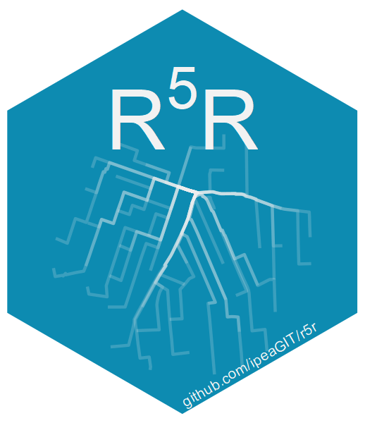

# r5r: Rapid Realistic Routing with R5 in R 

[](https://CRAN.R-project.org/package=r5r)
[](https://CRAN.R-project.org/package=r5r)
[](https://github.com/ipeaGIT/r5r/actions)
[](https://app.codecov.io/gh/ipeaGIT/r5r?branch=master)
[](https://lifecycle.r-lib.org/articles/stages.html)
[](https://doi.org/10.32866/001c.21262)

**Disclaimer**: this private version of r5r has been modified by me, and it may be unstable. The revisions are focusing on the detailed_itilnerary function and the csv output function. If you need a stable version, please go to the parent repository.

**r5r** is an `R` package for rapid realistic routing on multimodal transport 
networks (walk, bike, public transport and car). It provides a simple and 
friendly interface to R<sup>5</sup>, the [Rapid Realistic Routing on Real-world and Reimagined networks](https://github.com/conveyal/r5), the routing engine developed independently by [Conveyal](http://conveyal.com).

**r5r** is a simple way to run R<sup>5</sup> locally, allowing `R` users to
generate detailed routing analysis or calculate travel time matrices and 
accessibility using seamless parallel computing. See a detailed demonstration of
`r5r` in the [intro Vignette](https://ipeagit.github.io/r5r/articles/r5r.html).
More details about **r5r** can be found on the [package webpage](https://ipeagit.github.io/r5r/index.html) or on this [paper](
https://doi.org/10.32866/001c.21262). Over time, `r5r` might be expanded to 
incorporate other functionality from R<sup>5</sup>.

This repository contains the `R` code (r-package folder) and the Java code 
(java-api folder) that provides the interface to R<sup>5</sup>.

## Installation

You can install `r5r`:

```R
# From CRAN
  install.packages("r5r")
  library(r5r)

# or use the development version with latest features
  utils::remove.packages('r5r')
  devtools::install_github("ipeaGIT/r5r", subdir = "r-package")
  library(r5r)

```

Please bear in mind that you need to have *Java SE Development Kit 11* installed 
on your computer to use `r5r`. No worries, you don't have to pay for it. The jdk 
11 is freely available from the options below:
- [OpenJDK](http://jdk.java.net/java-se-ri/11)
- [Oracle](https://www.oracle.com/java/technologies/javase-jdk11-downloads.html)

If you don't know what version of Java you have installed on your computer, you 
can check it by running this on R console.

```R
rJava::.jinit()
rJava::.jcall("java.lang.System", "S", "getProperty", "java.version")
```

## Usage

The package has seven **fundamental functions**:

1. `setup_r5()`
   * Downloads and stores locally an R5 Jar file (the Jar file is downloaded only 
   once per installation)
   * Builds a multimodal transport network given (1) a OpenStreetMap street network in `.pbf`
   format (*mandatory*), (2) one or more public transport networks in `GTFS.zip`
   format  (optional), and (3) elevation data in `raster.tif` (optional).

2. `accessibility()`
   * Fast computation of access to opportunities. The function returns a 
   `data.table` with accessibility estimates for all origin points by transport 
   mode given a selected decay function. Multiple decay functions are available,
   including step (cumulative opportunities), logistic, fixed exponential and 
   linear.

3. `travel_time_matrix()`
   * Fast function that returns a simple `data.table` with travel time estimates
   between one or multiple origin destination pairs.

4. `expanded_travel_time_matrix()`
   * Calculates travel time matrices between origin destination pairs with 
   additional information such as routes used and total time disaggregated by access, 
   waiting, in-vehicle and transfer times.

5. `detailed_itineraries()`
   * Returns a `data.frame sf LINESTRINGs` with one or multiple alternative routes
   between one or multiple origin destination pairs. The data output brings 
   detailed information on transport mode, travel time, walk distance etc for 
   each trip segment.

6. `pareto_frontier()`
   * Returns a `data.table` with the travel time and monetary cost of multiple
   route alternatives for specified origin-destination pairs.
   
7. `isochrone()`
   * Returns a `A ⁠POLYGON  "sf" "data.frame"` showing the area that can be reached from an origin point at a given travel time limit.

obs. Most of these functions also allow users to account for monetary travel costs 
when generating travel time matrices and accessibility estimates. More info on
how to consider monetary costs can be found in [this vignette](https://ipeagit.github.io/r5r/articles/fare_structure.html).


The package also includes a few **support functions**.

1. `street_network_to_sf()`
   * Extract OpenStreetMap network in sf format from a `network.dat` file.

2. `transit_network_to_sf()`
   * Extract transit network in sf format from a `network.dat` file.

3. `find_snap()`
   * Find snapped locations of input points on street network.

4. `r5r_sitrep()`
   * Generate a situation report to help debug eventual errors.

### Data requirements:

To use `r5r`, you will need:
- A road network data set from OpenStreetMap in `.pbf` format (*mandatory*)
- A public transport feed in `GTFS.zip` format (optional)
- A raster file of Digital Elevation Model data in `.tif` format (optional)

Here are a few places from where you can download these data sets:

- OpenStreetMap
  - [osmextract](https://docs.ropensci.org/osmextract/) R package
  - [geofabrik](https://download.geofabrik.de/) website
  - [hot export tool](https://export.hotosm.org/) website
  - [BBBike.org](https://extract.bbbike.org/) website
  - [Protomaps](https://protomaps.com/downloads/osm) website

- GTFS
  - [tidytransit](https://r-transit.github.io/tidytransit/) R package
  - [transitland](https://www.transit.land/) website
  - [Mobility Database](https://database.mobilitydata.org/) website
  
- Elevation
  - [elevatr](https://github.com/jhollist/elevatr) R package
  - [Nasa's SRTMGL1](https://lpdaac.usgs.gov/products/srtmgl1v003/) website


### Demonstration on sample data

See a detailed demonstration of `r5r` in this [intro Vignette](https://ipeagit.github.io/r5r/articles/r5r.html). To illustrate
functionality, the package includes a small sample data set of the public transport
and Open Street Map networks of Porto Alegre (Brazil). Three steps are required to 
use `r5r`, as follows.

```R
# allocate RAM memory to Java
options(java.parameters = "-Xmx2G")

# 1) build transport network, pointing to the path where OSM and GTFS data are stored
library(r5r)
path <- system.file("extdata/poa", package = "r5r")
r5r_core <- setup_r5(data_path = path, verbose = FALSE)

# 2) load origin/destination points and set arguments
points <- read.csv(system.file("extdata/poa/poa_hexgrid.csv", package = "r5r"))
mode <- c("WALK", "TRANSIT")
max_walk_time <- 30   # minutes
max_trip_duration <- 60 # minutes
departure_datetime <- as.POSIXct("13-05-2019 14:00:00",
                                 format = "%d-%m-%Y %H:%M:%S")

# 3.1) calculate a travel time matrix
ttm <- travel_time_matrix(r5r_core = r5r_core,
                          origins = points,
                          destinations = points,
                          mode = mode,
                          departure_datetime = departure_datetime,
                          max_walk_time = max_walk_time,
                          max_trip_duration = max_trip_duration)

# 3.2) or get detailed info on multiple alternative routes
det <- detailed_itineraries(r5r_core = r5r_core,
                            origins = points[370, ],
                            destinations = points[200, ],
                            mode = mode,
                            departure_datetime = departure_datetime,
                            max_walk_time = max_walk_time,
                            max_trip_duration = max_trip_duration,
                            shortest_path = FALSE,
                            drop_geometry = FALSE)

# 4) Calculate number of schools accessible within 20 minutes 
access <- accessibility(r5r_core = r5r_core,
                        origins = points,
                        destinations = points,
                        opportunities_colname = "schools",
                        decay_function = "step",
                        cutoffs = 21,
                        mode =  c("WALK", "TRANSIT"),
                        verbose = FALSE)
```

#### **Related packages**

There is a growing number of `R` packages with functionalities for transport
routing, analysis and planning more broadly. Here are few of theses packages.

- [dodgr](https://github.com/ATFutures/dodgr): Distances on Directed Graphs in R
- [gtfsrouter](https://github.com/ATFutures/gtfs-router): R package for routing with GTFS data
- [hereR](https://github.com/munterfinger/hereR): an R interface to the HERE REST APIs 
- [opentripplanner](https://github.com/ropensci/opentripplanner): OpenTripPlanner for R
- [stplanr](https://github.com/ropensci/stplanr): sustainable transport planning with R

The **r5r** package is particularly focused on fast multimodal transport routing
and accessibility. A key advantage of `r5r` is that is provides a simple and 
friendly R interface to R<sup>5</sup>, one of the fastest and most robust routing
engines available.

For ***Python*** users, you might want to check our sister package: [**r5py**](https://r5py.readthedocs.io/en/stable/)!

-----

# Acknowledgement
The [R<sup>5</sup> routing engine](https://github.com/conveyal/r5) is developed 
at [Conveyal](https://www.conveyal.com/) with contributions from several people.

# Citation 

 The R package **r5r** is developed by a team at the Institute for Applied 
 Economic Research (Ipea), Brazil. If you use this package in research 
 publications, we please cite it as:

* Pereira, R. H. M., Saraiva, M., Herszenhut, D., Braga, C. K. V., & Conway, M. W. (2021). **r5r: Rapid Realistic Routing on Multimodal Transport Networks with R5 in R**. *Findings*, 21262. [https://doi.org/10.32866/001c.21262](https://doi.org/10.32866/001c.21262)

BibTeX:
```
@article{pereira_r5r_2021,
	title = {r5r: Rapid Realistic Routing on Multimodal Transport Networks with {R}$^{\textrm{5}}$ in R},
	shorttitle = {r5r},
	url = {https://findingspress.org/article/21262-r5r-rapid-realistic-routing-on-multimodal-transport-networks-with-r-5-in-r},
	doi = {10.32866/001c.21262},
	abstract = {Routing is a key step in transport planning and research. Nonetheless, researchers and practitioners often face challenges when performing this task due to long computation times and the cost of licensed software. R{\textasciicircum}5{\textasciicircum} is a multimodal transport network router that offers multiple routing features, such as calculating travel times over a time window and returning multiple itineraries for origin/destination pairs. This paper describes r5r, an open-source R package that leverages R{\textasciicircum}5{\textasciicircum} to efficiently compute travel time matrices and generate detailed itineraries between sets of origins and destinations at no expense using seamless parallel computing.},
	language = {en},
	urldate = {2021-03-04},
	journal = {Findings},
	author = {Pereira, Rafael H. M. and Saraiva, Marcus and Herszenhut, Daniel and Braga, Carlos Kaue Vieira and Conway, Matthew Wigginton},
	month = mar,
	year = {2021},
	note = {Publisher: Network Design Lab}
}
```

Please also cite the relevant publications relating to the R⁵ engine on which *r5r* builds up:

- Conway, M. W., Byrd, A., & van der Linden, M. (2017): **Evidence-Based Transit and Land Use Sketch Planning Using Interactive Accessibility Methods on Combined Schedule and Headway-Based Networks**. *Transportation Research Record*, 2653(1), 45–53. [DOI:10.3141/2653-06](https://doi.org/10.3141/2653-06)
- Conway, M. W., Byrd, A., & Van Eggermond, M. (2018): **Accounting for uncertainty and variation in accessibility metrics for public transport sketch planning**. *Journal of Transport and Land Use*, 11(1). [DOI:10.5198/jtlu.2018.1074](https://doi.org/10.5198/jtlu.2018.1074)
- Conway, M. W. & Stewart, A. F. (2019): **Getting Charlie off the MTA: a multiobjective optimization method to account for cost constraints in public transit accessibility metrics**. *International Journal of Geographical Information Science*, 33(9), 1759–1787. [DOI:10.1080/13658816.2019.1605075](https://doi.org/10.1080/13658816.2019.1605075)


