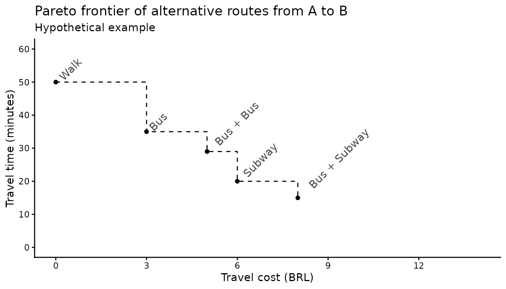
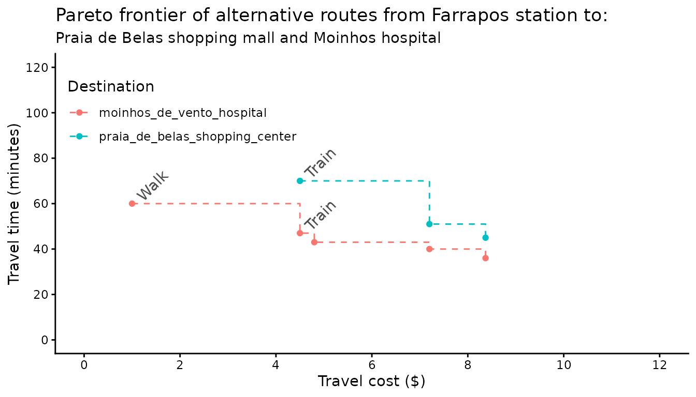

# Trade-offs between travel time and monetary cost

Abstract

This vignette shows how to use the
[`pareto_frontier()`](https://ipeagit.github.io/r5r/reference/pareto_frontier.md)
function to examine the trade-offs between travel time and monetary cost
in travel time matrices in r5r.

## 1. Introduction

Routing models usually find either the fastest or the cheapest route.
Accounting for both time and monetary cost at once is hard, because
minimizing trip duration and minimizing cost are competing objectives
(Conway and Stewart 2019). To address this problem, `r5r`’s
[`pareto_frontier()`](https://ipeagit.github.io/r5r/reference/pareto_frontier.md)
returns the most efficient combinations of travel time and monetary cost
between origin/destination pairs. This vignette shows, with a
reproducible example, how to use it and interpret its results.

### 2. What the `pareto_frontier` means.

Imagine a trip from A to B with several route alternatives (figure
below):

- Walking is the **cheapest** option but takes 50 minutes.
- Bus + subway is the **fastest**: 15 minutes for R\$ 8.
- In between:
  - a single bus: R\$ 3, 35 min;
  - two buses with one transfer: R\$ 5, 29 min;
  - walking to the subway: R\$ 6, 20 min.

These options form the **Pareto frontier** of routes from A to B: no
route is both faster and cheaper than any route on the frontier. On the
frontier, a trip cannot be made faster without costing more, nor cheaper
without taking longer.



  

The frontier shows the time-cost trade-offs that public transport
passengers face. It also supports cumulative-opportunity accessibility
metrics with both time and cost cutoffs (e.g. the number of jobs
reachable within 40 minutes and R\$ 5) (Conway and Stewart 2019). Let’s
see a couple concrete examples showing how `r5r` can calculate the
Pareto frontier for multiple origins.

### 3. Demonstration of `pareto_frontier()`.

#### 3.1 Build routable transport network with `build_network()`

We use the Porto Alegre (Brazil) sample data included in `r5r`.

``` r

# increase Java memory
options(java.parameters = "-Xmx2G")

# load libraries
library(r5r)
library(data.table)
library(ggplot2)
library(dplyr)

# build a routable transport network with r5r
data_path <- system.file("extdata/poa", package = "r5r")
r5r_network <- build_network(data_path)

# routing inputs
mode <- c('walk', 'transit')
max_trip_duration <- 90 # minutes

# load origin/destination points of interest
points <- fread(file.path(data_path, "poa_points_of_interest.csv"))
```

#### 3.2 Set up the fare structure

`R5` computes the monetary cost of each route from the fare rules of the
public transport system. In Porto Alegre:

- A bus ticket costs R\$ 4.80.
- A second bus ride adds R\$ 2.40; subsequent bus rides cost the full
  R\$ 4.80.
- A train ticket costs R\$ 4.50, with unlimited train rides as long as
  the passenger does not leave the stations.
- The integrated bus + train fare has a 10% discount, totalling R\$
  8.37.

A fare structure with these rules ships with `r5r`, so we simply read
it. The [fare structure
vignette](https://ipeagit.github.io/r5r/articles/fare_structure.html)
shows how to build one step by step.

``` r

fare_structure <- r5r::read_fare_structure(file.path(data_path, "fares/fares_poa.zip"))
```

#### 3.3 Calculating a `pareto_frontier()`.

We compute the Pareto frontier from all origins to all destinations with
these monetary cost cutoffs:

- R\$ 1.00: walking only
- R\$ 4.50: a train trip
- R\$ 4.80: a single bus trip
- R\$ 7.20: bus + bus
- R\$ 8.37: bus + train

``` r

departure_datetime <- as.POSIXct("13-05-2019 14:00:00",
                                 format = "%d-%m-%Y %H:%M:%S")

prtf <- pareto_frontier(
  r5r_network,
  origins = points,
  destinations = points,
  mode = c("WALK", "TRANSIT"),
  departure_datetime = departure_datetime,
  fare_structure = fare_structure,
  fare_cutoffs = c(1, 4.5, 4.8, 7.20, 8.37),
  progress = TRUE
  )
#> Loading required namespace: testthat

head(prtf)
#>          from_id               to_id percentile travel_time monetary_cost
#>           <char>              <char>      <int>       <int>         <num>
#> 1: public_market       public_market         50           0           1.0
#> 2: public_market bus_central_station         50          23           1.0
#> 3: public_market bus_central_station         50          19           4.5
#> 4: public_market bus_central_station         50          14           4.8
#> 5: public_market    gasometer_museum         50          29           1.0
#> 6: public_market    gasometer_museum         50          13           4.8
```

For illustration, the Pareto frontiers between the Farrapos train
station and (a) the Praia de Belas shopping mall and (b) the Moinhos
hospital:



#### Cleaning up after usage

Stop the network and run Java’s garbage collector to free the memory it
used:

``` r

r5r::stop_r5(r5r_network)
rJava::.jgc(R.gc = TRUE)
```

If you have any suggestions or want to report an error, please visit
[the package GitHub page](https://github.com/ipeaGIT/r5r).

### References

Conway, Matthew Wigginton, and Anson F. Stewart. 2019. “Getting Charlie
Off the MTA: A Multiobjective Optimization Method to Account for Cost
Constraints in Public Transit Accessibility Metrics.” *International
Journal of Geographical Information Science* 33 (9): 1759–87.
<https://doi.org/10.1080/13658816.2019.1605075>.
