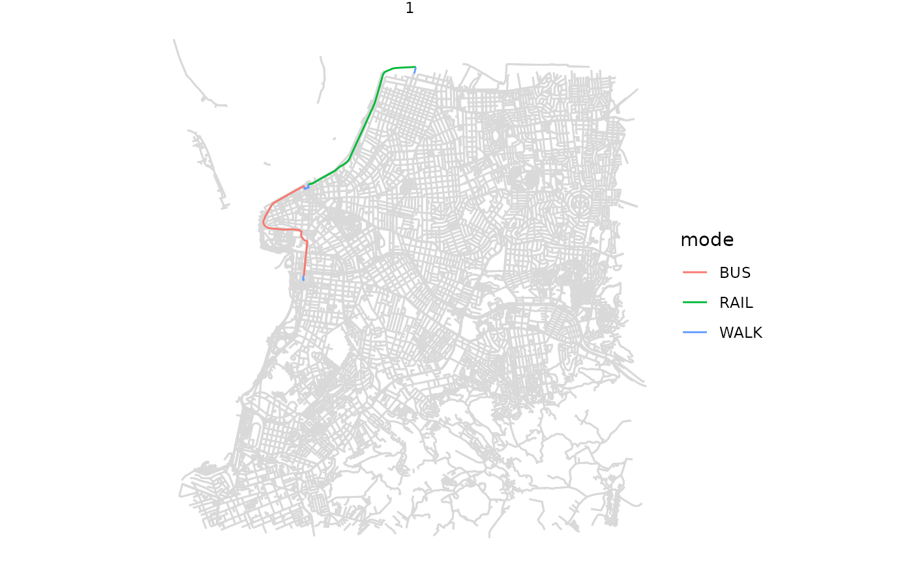

# Intro to r5r: Rapid Realistic Routing with R5 in R

Abstract

[r5r](https://github.com/ipeaGIT/r5r) is an R package for rapid
realistic routing on multimodal transport networks (walk, bike, public
transport and car) using R⁵. The package allows users to generate
detailed routing analysis or calculate travel time matrices using
seamless parallel computing on top of the R⁵ Java machine
<https://github.com/conveyal/r5>

## 1. Introduction

**r5r** is an [R package for rapid realistic routing on multimodal
transport networks](https://github.com/ipeaGIT/r5r) (walk, bike, public
transport and car). It provides a simple and friendly interface to R⁵, a
really fast and open source Java-based routing engine developed
separately by [Conveyal](https://www.conveyal.com/). R⁵ stands for
[Rapid Realistic Routing on Real-world and Reimagined
networks](https://github.com/conveyal/r5). More details about **r5r**
can be found on the [package
webpage](https://ipeagit.github.io/r5r/index.html) or on this
[paper](https://doi.org/10.32866/001c.21262).

## 2. Installation

You can install [r5r](https://github.com/ipeaGIT/r5r) from CRAN, or the
development version from github.

``` r

# from CRAN
install.packages('r5r')

# dev version with latest features
devtools::install_github("ipeaGIT/r5r", subdir = "r-package")
```

[r5r](https://github.com/ipeaGIT/r5r) requires the *Java Development Kit
(JDK) 21*. Any free, open-source JDK works, for example:

- [Adoptium/Eclipse Temurin](https://adoptium.net/) (our preferred
  option)
- [Amazon Corretto](https://aws.amazon.com/corretto/)
- [Oracle OpenJDK](https://jdk.java.net/21/).

The easiest way to install JDK 21 is with the
[{rJavaEnv}](https://www.ekotov.pro/rJavaEnv/) package in R:

``` r

# install {rJavaEnv} from CRAN
install.packages("rJavaEnv")

# check version of Java currently installed (if any) 
rJavaEnv::java_check_version_rjava()

## if this is the first time you use {rJavaEnv}, you might need to run this code
## below to consent the installation of Java.
# rJavaEnv::rje_consent(provided = TRUE)

# install Java 21
rJavaEnv::java_quick_install(version = 21)

# check if Java was successfully installed
rJavaEnv::java_check_version_rjava()
```

## 3. Usage

First, set the memory available to Java with the `java.parameters`
option (2 GB is enough for the sample data). Do this **before** loading
[r5r](https://github.com/ipeaGIT/r5r) or any other Java-based package:
`rJava` starts the Java Virtual Machine only once per R session, so
later changes only take effect after restarting R.

``` r

options(java.parameters = "-Xmx2G")

# By default, {r5r} uses all CPU cores available. If you want to limit the 
# number of CPUs to 4, for example, you can run:  
options(java.parameters = c("-Xmx2G", "-XX:ActiveProcessorCount=4"))
```

Then we can load the packages used in this vignette:

``` r

library(r5r)
library(sf)
library(data.table)
library(ggplot2)
```

[r5r](https://github.com/ipeaGIT/r5r) has eight **fundamental
functions**:

| Function | Returns |
|----|----|
| [`build_network()`](https://ipeagit.github.io/r5r/reference/build_network.md) | A routable multimodal transport network |
| [`accessibility()`](https://ipeagit.github.io/r5r/reference/accessibility.md) | Access to opportunities from each origin, given a decay function |
| [`travel_time_matrix()`](https://ipeagit.github.io/r5r/reference/travel_time_matrix.md) | Travel times between origin/destination pairs for a departure time |
| [`arrival_travel_time_matrix()`](https://ipeagit.github.io/r5r/reference/arrival_travel_time_matrix.md) | Travel times for an arrival time, with routes used (and a time breakdown with `breakdown = TRUE`) |
| [`expanded_travel_time_matrix()`](https://ipeagit.github.io/r5r/reference/expanded_travel_time_matrix.md) | Travel times per departure minute, with routes used (and a time breakdown with `breakdown = TRUE`) |
| [`detailed_itineraries()`](https://ipeagit.github.io/r5r/reference/detailed_itineraries.md) | One or more alternative routes per origin/destination pair, detailed by trip segment |
| [`pareto_frontier()`](https://ipeagit.github.io/r5r/reference/pareto_frontier.md) | The trade-off between travel time and monetary cost of route alternatives |
| [`isochrone()`](https://ipeagit.github.io/r5r/reference/isochrone.md) | Areas reachable from an origin within given travel times |

Most of them can also account for monetary travel costs ([fare structure
vignette](https://ipeagit.github.io/r5r/articles/fare_structure.html)).

**Support functions**:

| Function | Returns |
|----|----|
| [`street_network_to_sf()`](https://ipeagit.github.io/r5r/reference/street_network_to_sf.md) | The OpenStreetMap street network of a `network.dat` file, as `sf` |
| [`transit_network_to_sf()`](https://ipeagit.github.io/r5r/reference/transit_network_to_sf.md) | The public transport network of a `network.dat` file, as `sf` |
| [`find_snap()`](https://ipeagit.github.io/r5r/reference/find_snap.md) | Where input points snap to the street network |
| [`r5r_sitrep()`](https://ipeagit.github.io/r5r/reference/r5r_sitrep.md) | A situation report to help debug errors |

### 3.1 Data requirements:

To use [r5r](https://github.com/ipeaGIT/r5r), you will need:

- A road network data set from OpenStreetMap in `.pbf` format
  (*mandatory*)
- A public transport feed in `GTFS.zip` format (optional)
- A raster file of Digital Elevation Model data in `.tif` format
  (optional)

Here are a few places from where you can download these data sets:

- OpenStreetMap
  - [osmextract](https://docs.ropensci.org/osmextract/) R package
  - [geofabrik](https://download.geofabrik.de/) website
  - [hot export tool](https://export.hotosm.org/) website
  - [BBBike.org](https://extract.bbbike.org/) website
- GTFS
  - [tidytransit](https://r-transit.github.io/tidytransit/) R package
  - [transitland](https://www.transit.land/) website
  - [Mobility Database](https://mobilitydatabase.org/) website
- Elevation
  - [elevatr](https://github.com/USEPA/elevatr) R package
  - Nasa’s SRTMGL1 website

## 4. Demonstration on sample data

### Data

[r5r](https://github.com/ipeaGIT/r5r) includes sample data for Porto
Alegre (Brazil):

- An OpenStreetMap network: `poa_osm.pbf`
- Two public transport feeds: `poa_eptc.zip` and `poa_trensurb.zip`
- A raster elevation data: `poa_elevation.tif`
- A `poa_hexgrid.csv` file with spatial coordinates of a regular
  hexagonal grid covering the sample area, which can be used as
  origin/destination pairs in a travel time matrix calculation.
- A `poa_points_of_interest.csv` file containing the names and spatial
  coordinates of 15 places within Porto Alegre
- A `fares_poa.zip` file with the fare rules of the city’s public
  transport system.

``` r

data_path <- system.file("extdata/poa", package = "r5r")
list.files(data_path)
#>  [1] "fares"                      "gtfs_errors.csv"           
#>  [3] "network_settings.json"      "network.dat"               
#>  [5] "poa_elevation.tif"          "poa_eptc.zip"              
#>  [7] "poa_hexgrid.csv"            "poa_ls_lts.rds"            
#>  [9] "poa_osm_congestion.csv"     "poa_osm_lts.csv"           
#> [11] "poa_osm.pbf"                "poa_osm.pbf.mapdb"         
#> [13] "poa_osm.pbf.mapdb.p"        "poa_points_of_interest.csv"
#> [15] "poa_poly_congestion.rds"    "poa_trensurb.zip"          
#> [17] "r5r-log.log"
```

Points of interest, used below as origins and destinations:

``` r

poi <- fread(file.path(data_path, "poa_points_of_interest.csv"))
head(poi)
#>                     id       lat       lon
#>                 <char>     <num>     <num>
#> 1:       public_market -30.02756 -51.22781
#> 2: bus_central_station -30.02329 -51.21886
#> 3:    gasometer_museum -30.03404 -51.24095
#> 4: santa_casa_hospital -30.03043 -51.22240
#> 5:            townhall -30.02800 -51.22865
#> 6:     piratini_palace -30.03363 -51.23068
```

Hexagonal grid points; we use a random sample of 200:

``` r

points <- fread(file.path(data_path, "poa_hexgrid.csv"))

# sample points
sampled_rows <- sample(1:nrow(points), 200, replace = FALSE)
points <- points[ sampled_rows, ]
head(points)
#>                 id       lon       lat population schools  jobs healthcare
#>             <char>     <num>     <num>      <int>   <int> <int>      <int>
#> 1: 89a90128427ffff -51.20502 -30.08176        709       0     7          0
#> 2: 89a9012980fffff -51.17212 -30.02075       2073       0   127          0
#> 3: 89a90128043ffff -51.18627 -30.06949         21       1   100          0
#> 4: 89a9012828fffff -51.17700 -30.06612        965       0   219          0
#> 5: 89a90128657ffff -51.16852 -30.08209        678       0     0          0
#> 6: 89a9012826bffff -51.16740 -30.05445        240       1   180          0
```

### 4.1 Building routable transport network with `build_network()`

[`build_network()`](https://ipeagit.github.io/r5r/reference/build_network.md)
(1) downloads the R⁵ JAR (on first use or when the R⁵ version changes)
and caches it locally; and (2) combines the `.pbf`, GTFS `.zip` and
optional elevation `.tif` files in `data_path` into a routable network.

``` r

# Indicate the path where OSM and GTFS data are stored
r5r_network <- build_network(data_path = data_path)
```

### 4.2 Accessibility analysis

[`accessibility()`](https://ipeagit.github.io/r5r/reference/accessibility.md)
is the fastest way to estimate accessibility. Here we count the schools
and healthcare facilities reachable in less than 60 minutes by public
transport and walking ([accessibility
vignette](https://ipeagit.github.io/r5r/articles/accessibility.html)).

``` r

# set departure datetime input
departure_datetime <- as.POSIXct("13-05-2019 14:00:00",
                                 format = "%d-%m-%Y %H:%M:%S")

# calculate accessibility
access <- accessibility(
  r5r_network,
  origins = points,
  destinations = points,
  opportunities_colnames = c("schools", "healthcare"),
  mode = c("WALK", "TRANSIT"),
  departure_datetime = departure_datetime,
  decay_function = "step",
  cutoffs = 60
  )

head(access)
#>                 id opportunity percentile cutoff accessibility
#>             <char>      <char>      <int>  <int>         <num>
#> 1: 89a90128427ffff     schools         50     60            27
#> 2: 89a90128427ffff  healthcare         50     60            27
#> 3: 89a9012980fffff     schools         50     60            22
#> 4: 89a9012980fffff  healthcare         50     60            23
#> 5: 89a90128043ffff     schools         50     60            31
#> 6: 89a90128043ffff  healthcare         50     60            29
```

### 4.3 Routing analysis

For fast routing analysis, **r5r** currently has three core functions:
[`travel_time_matrix()`](https://ipeagit.github.io/r5r/reference/travel_time_matrix.md),
[`expanded_travel_time_matrix()`](https://ipeagit.github.io/r5r/reference/expanded_travel_time_matrix.md)
and
[`detailed_itineraries()`](https://ipeagit.github.io/r5r/reference/detailed_itineraries.md).

#### Fast many to many travel time matrix

[`travel_time_matrix()`](https://ipeagit.github.io/r5r/reference/travel_time_matrix.md)
computes travel times between origin/destination pairs. Origins and
destinations can be an `sf POINT` object or a `data.frame` with columns
`id`, `lon` and `lat`. `max_walk_time` and `max_trip_duration` are in
minutes, as are the resulting travel times.

It can also capture travel time variation across departures within a
time window ([time window
vignette](https://ipeagit.github.io/r5r/articles/time_window.html)).

``` r

# set inputs
mode <- c("WALK", "TRANSIT")
max_walk_time <- 30 # minutes
max_trip_duration <- 120 # minutes
departure_datetime <- as.POSIXct("13-05-2019 14:00:00",
                                 format = "%d-%m-%Y %H:%M:%S")

# calculate a travel time matrix
ttm <- travel_time_matrix(
  r5r_network,
  origins = poi,
  destinations = poi,
  mode = mode,
  departure_datetime = departure_datetime,
  max_walk_time = max_walk_time,
  max_trip_duration = max_trip_duration
  )

head(ttm)
#>          from_id               to_id travel_time_p50
#>           <char>              <char>           <int>
#> 1: public_market       public_market               0
#> 2: public_market bus_central_station              14
#> 3: public_market    gasometer_museum              12
#> 4: public_market santa_casa_hospital              15
#> 5: public_market            townhall               3
#> 6: public_market     piratini_palace              17
```

#### Expanded travel time matrix with minute-by-minute estimates

[`expanded_travel_time_matrix()`](https://ipeagit.github.io/r5r/reference/expanded_travel_time_matrix.md)
works like
[`travel_time_matrix()`](https://ipeagit.github.io/r5r/reference/travel_time_matrix.md)
but also returns, for each origin/destination pair, the routes used and
(with `breakdown = TRUE`) the access, waiting, in-vehicle and transfer
times. It can be very memory intensive for large data sets.

``` r

# calculate a travel time matrix
ettm <- expanded_travel_time_matrix(
  r5r_network,
  origins = poi,
  destinations = poi,
  mode = mode,
  departure_datetime = departure_datetime,
  breakdown = TRUE,
  max_walk_time = max_walk_time,
  max_trip_duration = max_trip_duration
  )

head(ettm)
#>          from_id         to_id departure_time draw_number access_time wait_time
#>           <char>        <char>         <char>       <int>       <num>     <num>
#> 1: public_market public_market       14:00:00           1           0         0
#> 2: public_market public_market       14:01:00           1           0         0
#> 3: public_market public_market       14:02:00           1           0         0
#> 4: public_market public_market       14:03:00           1           0         0
#> 5: public_market public_market       14:04:00           1           0         0
#> 6: public_market public_market       14:05:00           1           0         0
#>    ride_time transfer_time egress_time routes n_rides total_time
#>        <num>         <num>       <num> <char>   <int>      <num>
#> 1:         0             0           0 [WALK]       0          0
#> 2:         0             0           0 [WALK]       0          0
#> 3:         0             0           0 [WALK]       0          0
#> 4:         0             0           0 [WALK]       0          0
#> 5:         0             0           0 [WALK]       0          0
#> 6:         0             0           0 [WALK]       0          0
```

#### Detailed itineraries

Most routing packages return only the fastest route.
[`detailed_itineraries()`](https://ipeagit.github.io/r5r/reference/detailed_itineraries.md)
can also return alternative routes between origin/destination pairs,
detailed by trip segment: transport mode, waiting time, travel time and
distance.

Below, alternative routes for a single origin/destination pair:

``` r

# set inputs
origins <- poi[10,]
destinations <- poi[12,]
mode <- c("WALK", "TRANSIT")
max_walk_time <- 60 # minutes
departure_datetime <- as.POSIXct("13-05-2019 14:00:00",
                                 format = "%d-%m-%Y %H:%M:%S")

# calculate detailed itineraries
det <- detailed_itineraries(
  r5r_network,
  origins = origins,
  destinations = destinations,
  mode = mode,
  departure_datetime = departure_datetime,
  max_walk_time = max_walk_time,
  shortest_path = FALSE
  )

head(det)
#> Simple feature collection with 6 features and 16 fields
#> Geometry type: LINESTRING
#> Dimension:     XY
#> Bounding box:  xmin: -51.24094 ymin: -30.05 xmax: -51.19762 ymax: -29.99729
#> Geodetic CRS:  WGS 84
#>            from_id  from_lat  from_lon                          to_id    to_lat
#> 1 farrapos_station -29.99772 -51.19762 praia_de_belas_shopping_center -30.04995
#> 2 farrapos_station -29.99772 -51.19762 praia_de_belas_shopping_center -30.04995
#> 3 farrapos_station -29.99772 -51.19762 praia_de_belas_shopping_center -30.04995
#> 4 farrapos_station -29.99772 -51.19762 praia_de_belas_shopping_center -30.04995
#> 5 farrapos_station -29.99772 -51.19762 praia_de_belas_shopping_center -30.04995
#> 6 farrapos_station -29.99772 -51.19762 praia_de_belas_shopping_center -30.04995
#>      to_lon option departure_time total_duration total_distance segment mode
#> 1 -51.22875      1       14:07:57           35.6           9460       1 WALK
#> 2 -51.22875      1       14:07:57           35.6           9460       2 RAIL
#> 3 -51.22875      1       14:07:57           35.6           9460       3 WALK
#> 4 -51.22875      1       14:07:57           35.6           9460       4  BUS
#> 5 -51.22875      1       14:07:57           35.6           9460       5 WALK
#> 6 -51.22875      2       14:09:43           46.0           8779       1 WALK
#>   segment_duration wait distance  route                       geometry
#> 1              5.1  0.0      174        LINESTRING (-51.1981 -29.99...
#> 2              6.6  2.0     4796 LINHA1 LINESTRING (-51.19763 -29.9...
#> 3              4.0  0.0      256        LINESTRING (-51.22827 -30.0...
#> 4             10.4  4.4     4083    188 LINESTRING (-51.22926 -30.0...
#> 5              3.2  0.0      151        LINESTRING (-51.22949 -30.0...
#> 6              5.1  0.0      174        LINESTRING (-51.1981 -29.99...
```

The output is an `sf` data.frame, ready to map.

##### Visualize results

[`street_network_to_sf()`](https://ipeagit.github.io/r5r/reference/street_network_to_sf.md)
extracts the OSM street network used in routing, to give the map
geographic context:

``` r

# extract OSM network
street_net <- r5r::street_network_to_sf(r5r_network)

# extract public transport network
transit_net <- r5r::transit_network_to_sf(r5r_network)

# plot
ggplot() +
  geom_sf(data = street_net$edges, color='gray85') +
  geom_sf(data = det, aes(color=mode)) +
  facet_wrap(.~option) + 
  theme_void()
```



#### Cleaning up after usage

Stop the network and run Java’s garbage collector to free the memory it
used:

``` r

r5r::stop_r5(r5r_network)
rJava::.jgc(R.gc = TRUE)
```

If you have any suggestions or want to report an error, please visit
[the package GitHub page](https://github.com/ipeaGIT/r5r).
