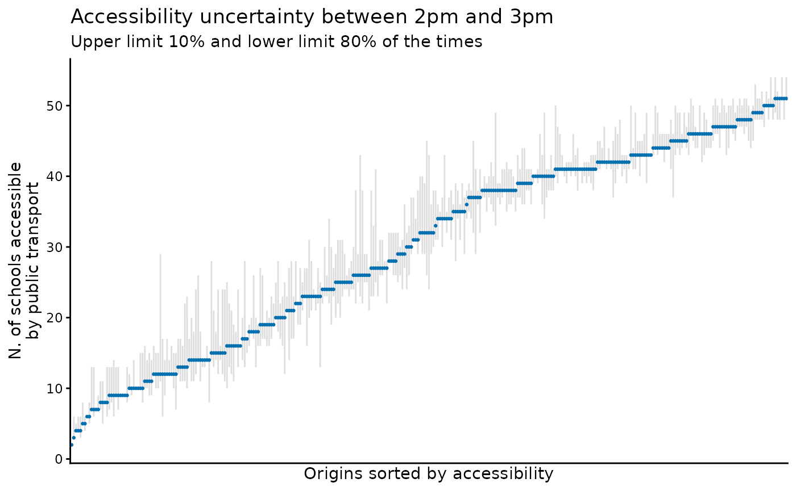

# Using the time_window parameter

Abstract

This vignette shows how to use and interpret the `time_window` parameter
in r5r.

## 1. Introduction

### The problem

Travel time and accessibility estimates require a departure time, and
they can differ significantly across departure times because public
transport service levels vary across the day (Stepniak et al. 2019).
Even leaving at `10:00am` instead of `10:04am` can change results
considerably, depending on when vehicles arrive and how well transfers
are coordinated. This relates to the modifiable temporal unit problem
(MTUP) (Pereira 2019; Levinson and et al. 2020).

The uncertainty is greater when GTFS feeds have a `frequencies.txt`
table, because exact vehicle departure times are unknown (Conway et al.
2018; Stewart and Byrd 2022).

### The solution

A common strategy is to compute estimates for multiple departure times
over a time window and take the average or median. Repeating the routing
for each departure is slow, though.

In `r5r`, functions such as
[`travel_time_matrix()`](https://ipeagit.github.io/r5r/reference/travel_time_matrix.md)
and
[`accessibility()`](https://ipeagit.github.io/r5r/reference/accessibility.md)
have a `time_window` parameter that does this in a single call. This
vignette shows how to use it and interpret the results.

## 2. How the `time_window` works and how to interpret the results.

With `time_window`, R⁵ computes an estimate for a departure every minute
from `departure_datetime` until the end of the window. If the GTFS feeds
have a `frequencies.txt` table, `draws_per_minute` sets the number of
Monte Carlo draws per minute (default 5, i.e. 300 draws in a 60-minute
window); without frequencies, departures are deterministic and
`draws_per_minute` does not affect results. For the effect of the number
of draws on result stability, see Stewart et al (2022).

The result is not a single estimate but a distribution reflecting the
uncertainty within the window. The `percentiles` parameter selects which
percentiles to return. For example, a 25th-percentile travel time of 15
minutes from A to B means that 25% of trips departing within the window
are shorter than 15 minutes.

## 3. Demonstration of `time_window`.

### 3.1 Build routable transport network with `build_network()`

We use the São Paulo (Brazil) sample data included in `r5r`.

``` r

# increase Java memory
options(java.parameters = "-Xmx2G")

# load libraries
library(r5r)
library(sf)
library(data.table)
library(ggplot2)
library(dplyr)

# build a routable transport network with r5r
data_path <- system.file("extdata/spo", package = "r5r")
r5r_network <- build_network(data_path)

# routing inputs
mode <- c('walk', 'transit')
max_walk_time <- 30 # minutes
max_trip_duration <- 90 # minutes

# load origin/destination points
points <- fread(file.path(data_path, "spo_hexgrid.csv"))

# departure datetime
departure_datetime = as.POSIXct("13-05-2019 14:00:00", 
                                format = "%d-%m-%Y %H:%M:%S")
```

### 3.2 Accessibility with `time_window`.

Number of schools reachable from each location within 45 minutes
(`decay_function = "step"`, `cutoffs = 45`), for departures between 2pm
and 3pm (`time_window = 60`):

``` r

# estimate accessibility
acc <- r5r::accessibility(
  r5r_network,   
  origins = points,
  destinations = points, 
  opportunities_colnames = 'schools',
  mode = mode,
  max_walk_time = max_walk_time,
  decay_function = "step",
  cutoffs = 45,
  departure_datetime = departure_datetime,
  progress = FALSE,
  time_window = 60,
  percentiles = c(10, 20, 50, 70, 80)
  )

head(acc, n = 10)
#>                  id opportunity percentile cutoff accessibility
#>              <char>      <char>      <int>  <int>         <num>
#>  1: 89a8100c603ffff     schools         10     45            13
#>  2: 89a8100c603ffff     schools         20     45            13
#>  3: 89a8100c603ffff     schools         50     45             7
#>  4: 89a8100c603ffff     schools         70     45             6
#>  5: 89a8100c603ffff     schools         80     45             6
#>  6: 89a8100c617ffff     schools         10     45            14
#>  7: 89a8100c617ffff     schools         20     45            13
#>  8: 89a8100c617ffff     schools         50     45             9
#>  9: 89a8100c617ffff     schools         70     45             6
#> 10: 89a8100c617ffff     schools         80     45             6
```

The output is in long format, one row per origin and percentile, so the
first 5 rows refer to the same origin. The 10th percentile counts the
schools reachable in at least 10% of departures, the 50th those
reachable in at least half of them; so accessibility never increases as
the percentile rises. An accessibility of 0 means no school is reachable
within 45 minutes.

The plot shows, for each origin (sorted by median), the range of
accessibility between the 10th and 80th percentiles, with the median as
a dot:

``` r

# summarize
df <- acc[, .(min_acc = min(accessibility),
              median = accessibility[which(percentile == 50)],
              max_acc = max(accessibility)), by = id]

# plot
ggplot(data=df) +
  geom_linerange(color='gray', alpha=.5, aes(x = reorder(id, median) , 
                      y=median, ymin=min_acc, ymax=max_acc)) +
  geom_point(color='#0570b0', size=.5, aes(x = reorder(id, median), y=median)) +
  labs(y='N. of schools accessible\nby public transport', x='Origins sorted by accessibility',
       title="Accessibility uncertainty between 2pm and 3pm",
       subtitle = 'Upper limit 10% and lower limit 80% of the times') +
  theme_classic() +
  theme(axis.text.x=element_blank(),
        axis.ticks.x=element_blank())
```



### 3.3 Travel time matrix with `time_window`.

All-to-all travel times for departures between 2pm and 3pm:

``` r

# estimate travel time matrix
ttm <- travel_time_matrix(
  r5r_network,   
  origins = points,
  destinations = points,    
  mode = mode,
  max_walk_time = max_walk_time,
  max_trip_duration = max_trip_duration,
  departure_datetime = departure_datetime,
  progress = TRUE,
  time_window = 60,
  percentiles = c(10, 20, 50, 70, 80)
  )

head(ttm, n = 10)
#>             from_id           to_id travel_time_p10 travel_time_p20
#>              <char>          <char>           <int>           <int>
#>  1: 89a8100c603ffff 89a8100c603ffff               0               0
#>  2: 89a8100c603ffff 89a8100c617ffff              13              13
#>  3: 89a8100c603ffff 89a8100c60fffff               6               6
#>  4: 89a8100c603ffff 89a8100c607ffff              11              11
#>  5: 89a8100c603ffff 89a8100c6abffff              20              20
#>  6: 89a8100c603ffff 89a8100c6a3ffff              26              26
#>  7: 89a8100c603ffff 89a8100c677ffff              14              14
#>  8: 89a8100c603ffff 89a8100c63bffff              14              14
#>  9: 89a8100c603ffff 89a8100c633ffff              16              16
#> 10: 89a8100c603ffff 89a8100c6afffff              24              24
#>     travel_time_p50 travel_time_p70 travel_time_p80
#>               <int>           <int>           <int>
#>  1:               0               0               0
#>  2:              13              13              13
#>  3:               6               6               6
#>  4:              11              11              11
#>  5:              20              20              20
#>  6:              26              26              26
#>  7:              14              14              14
#>  8:              14              14              14
#>  9:              16              16              16
#> 10:              24              24              24
```

Each `travel_time_pXX` column gives the travel time within which XX% of
the trips departing between 2pm and 3pm are completed: `travel_time_p10`
for the fastest 10%, `travel_time_p50` the median, and so on. An `NA`
means fewer than XX% of the trips arrive within `max_trip_duration` (90
minutes).

### 3.4 Expanded travel time matrix with `time_window`.

With `time_window`,
[`expanded_travel_time_matrix()`](https://ipeagit.github.io/r5r/reference/expanded_travel_time_matrix.md)
returns the fastest route departing at each minute of the window,
instead of percentiles. It can be very memory intensive for large data
sets and time windows.

``` r

ettm <- r5r::expanded_travel_time_matrix(
  r5r_network,
  origins = points[1:30,],
  destinations = points[31:61,],    
  mode = mode,
  max_walk_time = max_walk_time,
  max_trip_duration = max_trip_duration,
  departure_datetime = departure_datetime,
  progress = FALSE,
  time_window = 20
  )

head(ettm, n = 10)
#>             from_id           to_id departure_time draw_number  routes
#>              <char>          <char>         <char>       <int>  <char>
#>  1: 89a8100c603ffff 89a8100c28bffff       14:00:00           1 4491-10
#>  2: 89a8100c603ffff 89a8100c28bffff       14:00:00           2 4491-10
#>  3: 89a8100c603ffff 89a8100c28bffff       14:00:00           3 4491-10
#>  4: 89a8100c603ffff 89a8100c28bffff       14:00:00           4 4491-10
#>  5: 89a8100c603ffff 89a8100c28bffff       14:00:00           5 4491-10
#>  6: 89a8100c603ffff 89a8100c28bffff       14:01:00           1 4491-10
#>  7: 89a8100c603ffff 89a8100c28bffff       14:01:00           2 4491-10
#>  8: 89a8100c603ffff 89a8100c28bffff       14:01:00           3 4491-10
#>  9: 89a8100c603ffff 89a8100c28bffff       14:01:00           4 4491-10
#> 10: 89a8100c603ffff 89a8100c28bffff       14:01:00           5 4491-10
#>     total_time
#>          <num>
#>  1:       38.5
#>  2:       38.3
#>  3:       47.4
#>  4:       48.6
#>  5:       35.3
#>  6:       41.5
#>  7:       38.0
#>  8:       51.4
#>  9:       49.5
#> 10:       48.1
```

### 3.5 Detailed itineraries with `time_window`.

[`detailed_itineraries()`](https://ipeagit.github.io/r5r/reference/detailed_itineraries.md)
returns itineraries rather than travel time or accessibility
percentiles. With `time_window`, it returns the fastest itinerary: the
shortest travel time measured from its own departure, so it may depart
and arrive later than others (use `time_window = 1` for the earliest
arrival). With `shortest_path = FALSE`, it also returns sub-optimal
alternatives.

Its number of draws per minute is fixed at 1: it simulates about one
departure per minute of `time_window`, at random seconds (consecutive
departures are 30 to 90 seconds apart, and the same departure times are
used in every call with the same origin). So a 10-minute `time_window`
simulates about 10 departures. Each departure is routed separately, and
with the default `suboptimal_minutes = 0` only the itineraries arriving
earliest are kept for each departure, even if a slower one has fewer
transfers.

*obs.*
[`detailed_itineraries()`](https://ipeagit.github.io/r5r/reference/detailed_itineraries.md)
cannot route public transport trips on frequency-based GTFS feeds; use
[`gtfstools::frequencies_to_stop_times()`](https://rdrr.io/pkg/gtfstools/man/frequencies_to_stop_times.html)
to create a suitable feed.

### Cleaning up after usage

Stop the network and run Java’s garbage collector to free the memory it
used:

``` r

r5r::stop_r5(r5r_network)
rJava::.jgc(R.gc = TRUE)
```

If you have any suggestions or want to report an error, please visit
[the package GitHub page](https://github.com/ipeaGIT/r5r).

## References

Conway, Matthew Wigginton, Andrew Byrd, and Michael van Eggermond. 2018.
“Accounting for Uncertainty and Variation in Accessibility Metrics for
Public Transport Sketch Planning.” *Journal of Transport and Land Use*
11 (1). <https://doi.org/10.5198/jtlu.2018.1074>.

Levinson, David, and et al. 2020. *Transport Access Manual: A Guide for
Measuring Connection Between People and Places*. January 1.
<https://hdl.handle.net/2123/23733>.

Pereira, Rafael H. M. 2019. “Future Accessibility Impacts of Transport
Policy Scenarios: Equity and Sensitivity to Travel Time Thresholds for
Bus Rapid Transit Expansion in Rio de Janeiro.” *Journal of Transport
Geography* 74 (January): 321–32.
<https://doi.org/10.1016/j.jtrangeo.2018.12.005>.

Stepniak, Marcin, John P. Pritchard, Karst T. Geurs, and Slawomir
Goliszek. 2019. “The Impact of Temporal Resolution on Public Transport
Accessibility Measurement: Review and Case Study in Poland.” *Journal of
Transport Geography* 75 (February): 8–24.
<https://doi.org/10.1016/j.jtrangeo.2019.01.007>.

Stewart, Anson F, and Andrew M Byrd. 2022. “Half-(head)way There:
Comparing Two Methods to Account for Public Transport Waiting Time in
Accessibility Indicators.” *Environment and Planning B: Urban Analytics
and City Science*, November 30, 23998083221137077.
<https://doi.org/10.1177/23998083221137077>.
