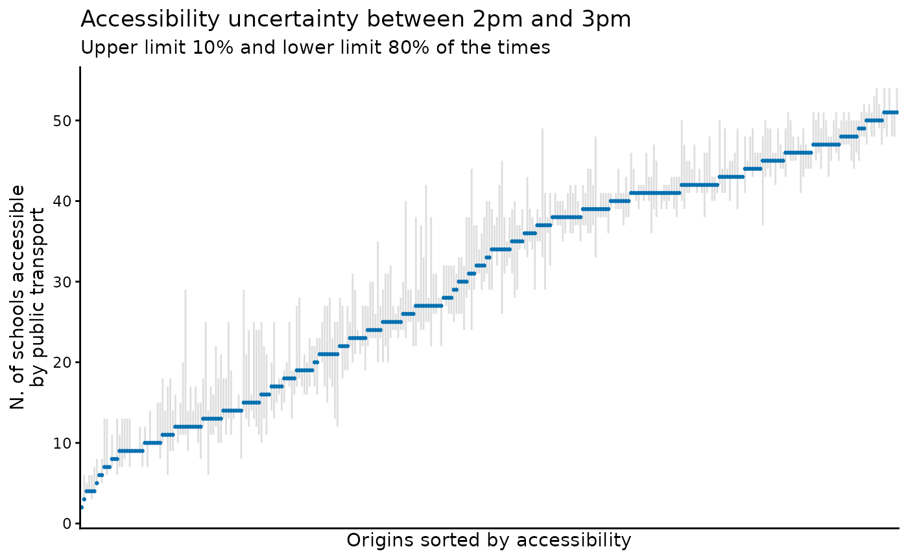

# Using the time_window parameter

Abstract

This vignette shows how to use and interpret the `time_window` parameter
in r5r.

## 1. Introduction

### The problem

To calculate the travel time from A to B, or to calculate the
accessibility level at a given location, one has to select a departure
time. However, travel time and accessibility estimates can differ
significantly at different departure times because of how public
transport service levels vary across the day (Stepniak et al. 2019).
Even a small difference, say leaving at `10:00am` or `10:04am` might
importantly change travel time and accessibility estimates depending on
when a person departs relative to when a public transport vehicle
arrives, and how well transfers are coordinated given a service
timetable. This is a very common issue related to the modifiable
temporal unit problem (MTUP) (Pereira 2019; Levinson and et al. 2020).

This problem gets even more complicated when public transport GTFS feeds
have a `frequencies.txt` table. In these cases, we cannot know the exact
departure time of vehicles, what creates greater uncertainty for our
travel time and accessibility estimates (Conway, Byrd, and van Eggermond
2018; Stewart and Byrd 2022).

### The solution

A common strategy to overcome this problem is to calculate travel times
and accessibilities at multiple departure times sampled over a time
window, and then take the average or median value. Now you may ask, but
how many departure times should I use? You might also be thinking that
doing multiple repeated routing analysis can be cumbersome and take a
lot of time. Right?

Here is where `r5r` comes in. Both the
[`travel_time_matrix()`](https://ipeagit.github.io/r5r/reference/travel_time_matrix.md)and
[`accessibility()`](https://ipeagit.github.io/r5r/reference/accessibility.md)
functions have a parameter called `time_window`. When this parameter is
set, R⁵ will automatically compute multiple travel times / accessibility
estimates considering multiple departures per minute within the
`time_window` selected by the user.

This vignette shows a reproducible example to explain how one can use
the `time_window` and interpret the results.

## 2. How the `time_window` works and how to interpret the results.

As mentioned above, when `time_window` is set, R⁵ computes multiple
travel times / accessibility estimates starting at the specified
`departure_datetime` and within the `time_window` selected by the user.
By default, `r5r` will generate one estimate per minute. Nonetheless,
users can set a number to the `draws_per_minute` parameter that will
change the number of Monte Carlo draws to perform per time window
minute. The default value of `draws_per_minute` is 5, which mean 300
draws in a 60 minutes time window, for example. For a detailed
discussion on the effect of number of draws on result stability, see
Stewart et al (2022).

In this case, there isn’t a single estimate of travel time /
accessibility, but a distribution of several estimates that reflect the
travel time / accessibility uncertainties in the specified time window.
To get our heads around so many estimates, we can use the `percentiles`
parameter to specify the percentiles of the distribution we are
interested in. For example, if we select the 25th travel time percentile
and the results show that the travel time estimate between A and B is 15
minutes, this means that 25% of all trips taken between these points
within the specified time window are shorter than 15 minutes.

Let’s see a couple concrete examples now.

## 3. Demonstration of `time_window`.

### 3.1 Build routable transport network with `build_network()`

First, let’s build the network and create the routing inputs. In this
example we’ll be using the a sample data set for the city of São Paulo
(Brazil) included in `r5r`.

``` r
# increase Java memory
options(java.parameters = "-Xmx2G")

# load libraries
library(r5r)
library(sf)
library(data.table)
library(ggplot2)
library(dplyr)

# build a routable transport network with r5r
data_path <- system.file("extdata/spo", package = "r5r")
r5r_network <- build_network(data_path)

# routing inputs
mode <- c('walk', 'transit')
max_walk_time <- 30 # minutes
max_trip_duration <- 90 # minutes

# load origin/destination points
points <- fread(file.path(data_path, "spo_hexgrid.csv"))

# departure datetime
departure_datetime = as.POSIXct("13-05-2019 14:00:00", 
                                format = "%d-%m-%Y %H:%M:%S")
```

ps. Please keep in mind that the Monte Carlo draws in `time_window` only
affects the results when the GTFS feeds contain a `frequencies.txt`
table. If the GTFS feed does not have a frequency table, r5r still allow
for multiple runs over the set `time_window` in a deterministic way.

### 3.2 Accessibility with `time_window`.

In this example we calculate the number of schools accessible from each
location within a 60-minute time window departing between 2pm and 3pm.
In this example we’ll be using a cumulative accessibility metric
`decay_function = "step"` with a max time threshold of 45 minutes
`cutoffs = 45`.

``` r
# estimate accessibility
acc <- r5r::accessibility(
  r5r_network,   
  origins = points,
  destinations = points, 
  opportunities_colnames = 'schools',
  mode = mode,
  max_walk_time = max_walk_time,
  decay_function = "step",
  cutoffs = 45,
  departure_datetime = departure_datetime,
  progress = FALSE,
  time_window = 60,
  percentiles = c(10, 20, 50, 70, 80)
  )

head(acc, n = 10)
#>                  id opportunity percentile cutoff accessibility
#>              <char>      <char>      <int>  <int>         <num>
#>  1: 89a8100c603ffff     schools         10     45            13
#>  2: 89a8100c603ffff     schools         20     45            13
#>  3: 89a8100c603ffff     schools         50     45             6
#>  4: 89a8100c603ffff     schools         70     45             6
#>  5: 89a8100c603ffff     schools         80     45             6
#>  6: 89a8100c617ffff     schools         10     45            14
#>  7: 89a8100c617ffff     schools         20     45            13
#>  8: 89a8100c617ffff     schools         50     45            12
#>  9: 89a8100c617ffff     schools         70     45             6
#> 10: 89a8100c617ffff     schools         80     45             6
```

This output is in long format, so the first 5 rows show the result for
the same origin. In this case, we see that in only 10% of the trips
departing from that origin between 2pm and 3pm a person would be able to
access up to 111 schools. Meanwhile, 50% of the times she would only
access 79 schools. By contrast, the accessibility from the other origin
shown in the output above is 0, meaning there are no schools accessible
from that location given the max travel time of 45 minutes.

We can use a plot like the one below to visualize this uncertainty in
how accessibility levels might vary between 2pm and 3pm depending on the
departure time within that 60-minute time window.

``` r
# summarize
df <- acc[, .(min_acc = min(accessibility),
              median = accessibility[which(percentile == 50)],
              max_acc = max(accessibility)), by = id]

# plot
ggplot(data=df) +
  geom_linerange(color='gray', alpha=.5, aes(x = reorder(id, median) , 
                      y=median, ymin=min_acc, ymax=max_acc)) +
  geom_point(color='#0570b0', size=.5, aes(x = reorder(id, median), y=median)) +
  labs(y='N. of schools accessible\nby public transport', x='Origins sorted by accessibility',
       title="Accessibility uncertainty between 2pm and 3pm",
       subtitle = 'Upper limit 10% and lower limit 80% of the times') +
  theme_classic() +
  theme(axis.text.x=element_blank(),
        axis.ticks.x=element_blank())
```



### 3.3 Travel time matrix with `time_window`.

Now let’s calculate all-to-all travel time estimates within a 60-minute
time window departing between 2pm and 3pm and see how the output looks
like.

``` r
# estimate travel time matrix
ttm <- travel_time_matrix(
  r5r_network,   
  origins = points,
  destinations = points,    
  mode = mode,
  max_walk_time = max_walk_time,
  max_trip_duration = max_trip_duration,
  departure_datetime = departure_datetime,
  progress = TRUE,
  time_window = 60,
  percentiles = c(10, 20, 50, 70, 80)
  )

head(ttm, n = 10)
#>             from_id           to_id travel_time_p10 travel_time_p20
#>              <char>          <char>           <int>           <int>
#>  1: 89a8100c603ffff 89a8100c603ffff               0               0
#>  2: 89a8100c603ffff 89a8100c617ffff              13              13
#>  3: 89a8100c603ffff 89a8100c60fffff               6               6
#>  4: 89a8100c603ffff 89a8100c607ffff              11              11
#>  5: 89a8100c603ffff 89a8100c6abffff              20              20
#>  6: 89a8100c603ffff 89a8100c6a3ffff              26              26
#>  7: 89a8100c603ffff 89a8100c677ffff              14              14
#>  8: 89a8100c603ffff 89a8100c63bffff              14              14
#>  9: 89a8100c603ffff 89a8100c633ffff              16              16
#> 10: 89a8100c603ffff 89a8100c6afffff              24              24
#>     travel_time_p50 travel_time_p70 travel_time_p80
#>               <int>           <int>           <int>
#>  1:               0               0               0
#>  2:              13              13              13
#>  3:               6               6               6
#>  4:              11              11              11
#>  5:              20              20              20
#>  6:              26              26              26
#>  7:              14              14              14
#>  8:              14              14              14
#>  9:              16              16              16
#> 10:              24              24              24
```

Now let’s look at the 2nd row of the output above. This output tell us
that only 10% of the trips between 2pm and 3pm for that
origin-destination pair took 39 minutes or less. Meanwhile, 50% of those
trips took up tp 45 minutes and 80% of them were 48-minute long or
shorter.

The last row in the result above has a few `NA`s. This tell us that at
least 50% of all simulated trips between 2pm and 3pm for that
origin-destination pair could not be completed because they took longer
than the `max_trip_duration` we have set (90 minutes).

### 3.4 Expanded travel time matrix with `time_window`.

Finally, we can also use the `time_window` in the
[`expanded_travel_time_matrix()`](https://ipeagit.github.io/r5r/reference/expanded_travel_time_matrix.md)
function. In this case, though, when the user sets a `time_window`
value, the
[`expanded_travel_time_matrix()`](https://ipeagit.github.io/r5r/reference/expanded_travel_time_matrix.md)
will return the fastest route alternative departing each minute within
the specified time window. Please note this function can be very memory
intensive for large data sets and time windows.

``` r
ettm <- r5r::expanded_travel_time_matrix(
  r5r_network,
  origins = points[1:30,],
  destinations = points[31:61,],    
  mode = mode,
  max_walk_time = max_walk_time,
  max_trip_duration = max_trip_duration,
  departure_datetime = departure_datetime,
  progress = FALSE,
  time_window = 20
  )

head(ettm, n = 10)
#>             from_id           to_id departure_time draw_number  routes
#>              <char>          <char>         <char>       <int>  <char>
#>  1: 89a8100c603ffff 89a8100c28bffff       14:00:00           1 4491-10
#>  2: 89a8100c603ffff 89a8100c28bffff       14:00:00           2 4491-10
#>  3: 89a8100c603ffff 89a8100c28bffff       14:00:00           3 4491-10
#>  4: 89a8100c603ffff 89a8100c28bffff       14:00:00           4 4491-10
#>  5: 89a8100c603ffff 89a8100c28bffff       14:00:00           5 4491-10
#>  6: 89a8100c603ffff 89a8100c28bffff       14:01:00           1 4491-10
#>  7: 89a8100c603ffff 89a8100c28bffff       14:01:00           2 4491-10
#>  8: 89a8100c603ffff 89a8100c28bffff       14:01:00           3 4491-10
#>  9: 89a8100c603ffff 89a8100c28bffff       14:01:00           4 4491-10
#> 10: 89a8100c603ffff 89a8100c28bffff       14:01:00           5 4491-10
#>     total_time
#>          <num>
#>  1:       51.3
#>  2:       46.9
#>  3:       51.3
#>  4:       40.4
#>  5:       34.9
#>  6:       52.9
#>  7:       43.7
#>  8:       43.5
#>  9:       41.8
#> 10:       39.3
```

### 3.5 Detailed itineraries with `time_window`.

In the
[`detailed_itineraries()`](https://ipeagit.github.io/r5r/reference/detailed_itineraries.md)
function, the number of Monte Carlo draws per minute is hardcoded to 1.
This means that the function simulates only one departure per minute
within the `time_window`. So if you set a `time_window` of 10 minutes,
it would simulate 10 departures, one in each minute. This is largely
because the `time_window` behaves slightly differently here.

See, functions like
[`travel_time_matrix()`](https://ipeagit.github.io/r5r/reference/travel_time_matrix.md)
or
[`accessibility()`](https://ipeagit.github.io/r5r/reference/accessibility.md),
for example, return estimates of travel times or accessibility. In these
cases, when we use the `time_window` parameter, these functions output
selected percentiles of those values generated based on the distribution
of all estimates that result from the multiple trip simulations.

The
[`detailed_itineraries()`](https://ipeagit.github.io/r5r/reference/detailed_itineraries.md),
on the other hand, does not return travel times or accessibility
estimates. It returns alternatives of trip journeys. In this case, when
we use the `time_window` parameter, the function will return the optimal
trip itinerary found within the time window. It can also return the
optimal route along with multiple sub-optimal journey alternatives found
within the time window if the the user sets `shortest_path = FALSE`.

*obs.* Mind you that
[`detailed_itineraries()`](https://ipeagit.github.io/r5r/reference/detailed_itineraries.md)
cannot be computed for public transport trips if the the network uses a
frequencies-based GTFS feed. In these cases, we suggest using
[`gtfstools::frequencies_to_stop_times()`](https://ipeagit.github.io/gtfstools/reference/frequencies_to_stop_times.html)
to create a suitable feed.

### Cleaning up after usage

`r5r` objects are still allocated to any amount of memory previously set
after they are done with their calculations. In order to remove an
existing `r5r` object and reallocate the memory it had been using, we
use the `stop_r5` function followed by a call to Java’s garbage
collector, as follows:

``` r
r5r::stop_r5(r5r_network)
rJava::.jgc(R.gc = TRUE)
```

If you have any suggestions or want to report an error, please visit
[the package GitHub page](https://github.com/ipeaGIT/r5r).

## References

Conway, Matthew Wigginton, Andrew Byrd, and Michael van Eggermond. 2018.
“Accounting for Uncertainty and Variation in Accessibility Metrics for
Public Transport Sketch Planning.” *Journal of Transport and Land Use*
11 (1). <https://doi.org/10.5198/jtlu.2018.1074>.

Levinson, David, and et al. 2020. “Transport Access Manual: A Guide for
Measuring Connection Between People and Places,” January.
<https://hdl.handle.net/2123/23733>.

Pereira, Rafael H. M. 2019. “Future Accessibility Impacts of Transport
Policy Scenarios: Equity and Sensitivity to Travel Time Thresholds for
Bus Rapid Transit Expansion in Rio de Janeiro.” *Journal of Transport
Geography* 74 (January): 321–32.
<https://doi.org/10.1016/j.jtrangeo.2018.12.005>.

Stepniak, Marcin, John P. Pritchard, Karst T. Geurs, and Slawomir
Goliszek. 2019. “The Impact of Temporal Resolution on Public Transport
Accessibility Measurement: Review and Case Study in Poland.” *Journal of
Transport Geography* 75 (February): 8–24.
<https://doi.org/10.1016/j.jtrangeo.2019.01.007>.

Stewart, Anson F, and Andrew M Byrd. 2022. “Half-(head)way There:
Comparing Two Methods to Account for Public Transport Waiting Time in
Accessibility Indicators.” *Environment and Planning B: Urban Analytics
and City Science*, November, 23998083221137077.
<https://doi.org/10.1177/23998083221137077>.
