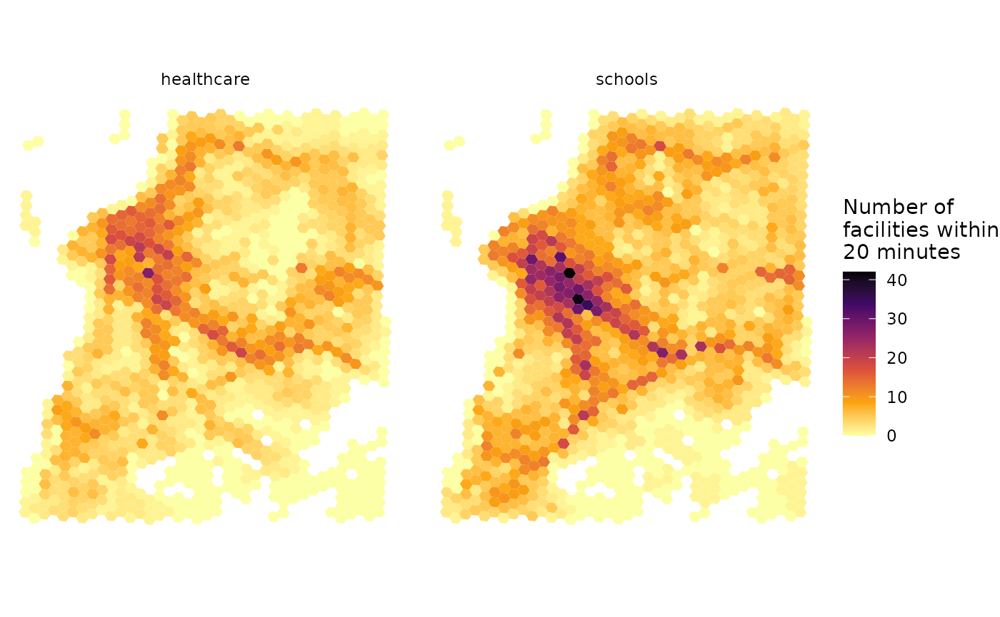
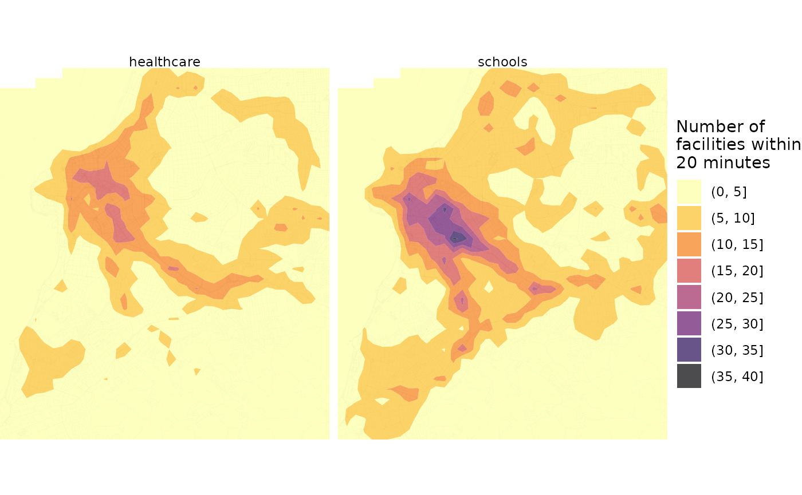

# Accessibility

Abstract

This vignette shows how to calculate and visualize accessibility in R
using the `r5r` package.

## 1. Introduction

Accessibility indicators measure how easily opportunities, such as jobs,
can be reached from a given location (Levinson and et al. 2020). This
vignette calculates and maps accessibility with the [`r5r`
package](https://ipea.github.io/r5r/index.html), using the Porto Alegre
(Brazil) sample data included in `r5r`, in two ways:

- **quick:**
  [`r5r::accessibility()`](https://ipea.github.io/r5r/dev/reference/accessibility.md);
- **flexible:** an `r5r` travel time matrix passed to the
  [{accessibility} package](https://ipea.github.io/accessibility/),
  which offers a wider range of metrics.

## 2. Build routable transport network with `build_network()`

#### Increase Java memory and load libraries

Set Java memory before loading the packages
([why](https://ipea.github.io/r5r/articles/r5r.html#usage)).

``` r

options(java.parameters = "-Xmx2G")

library(r5r)
library(accessibility)
library(sf)
library(data.table)
library(ggplot2)
library(interp)
library(h3jsr)
library(dplyr)
```

[`build_network()`](https://ipea.github.io/r5r/dev/reference/build_network.md)
takes the directory holding the OpenStreetMap and GTFS data:

``` r

# system.file returns the directory with example data inside the r5r package
# set data path to directory containing your own data if not running this example
data_path <- system.file("extdata/poa", package = "r5r")

r5r_network <- build_network(data_path)
```

## 3. Accessibility: quick and easy approach

One of the simplest accessibility metrics is the cumulative-opportunity
metric: the number of opportunities reachable within a travel time
cutoff (`decay_function = "step"`).

Here we count the schools (`points$schools`) and public healthcare
facilities (`points$healthcare`) reachable by public transport in less
than 20 minutes, using the median travel time of departures every minute
over a 60-minute window (2pm to 3pm).
[`accessibility()`](https://ipea.github.io/r5r/dev/reference/accessibility.md)
handles several opportunity types in one call, which is much more
efficient than computing a travel time matrix and aggregating it
yourself.

``` r

# read all points in the city
points <- fread(file.path(data_path, "poa_hexgrid.csv"))

# routing inputs
mode <- c("WALK", "TRANSIT")
max_walk_time <- 30      # in minutes
travel_time_cutoff <- 20 # in minutes
time_window <- 60        # in minutes
departure_datetime <- as.POSIXct("13-05-2019 14:00:00",
                                 format = "%d-%m-%Y %H:%M:%S")

# calculate accessibility
access1 <- r5r::accessibility(
  r5r_network,
  origins = points,
  destinations = points,
  mode = mode,
  opportunities_colnames = c("schools", "healthcare"),
  decay_function = "step",
  cutoffs = travel_time_cutoff,
  departure_datetime = departure_datetime,
  max_walk_time = max_walk_time,
  time_window = time_window,
  progress = FALSE
  )

head(access1)
#>                 id opportunity percentile cutoff accessibility
#>             <char>      <char>      <int>  <int>         <num>
#> 1: 89a901291abffff     schools         50     20             3
#> 2: 89a901291abffff  healthcare         50     20             5
#> 3: 89a9012a3cfffff     schools         50     20             0
#> 4: 89a9012a3cfffff  healthcare         50     20             0
#> 5: 89a901295b7ffff     schools         50     20             6
#> 6: 89a901295b7ffff  healthcare         50     20             4
```

[`r5r::accessibility()`](https://ipea.github.io/r5r/dev/reference/accessibility.md)
also computes gravity-based metrics: set `decay_function` to
`"exponential"`, `"fixed_exponential"`, `"linear"` or `"logistic"`.
Metrics not implemented in R5, such as floating catchment area, travel
cost to the closest N opportunities or time-interval cumulative
opportunities, are available in the
[accessibility](https://github.com/ipeaGIT/accessibility) package.

## 4. Accessibility: flexible approach

The [accessibility](https://github.com/ipeaGIT/accessibility) package
takes a [travel time
matrix](https://ipea.github.io/r5r/articles/travel_time_matrix.html),
which we compute with `r5r`:

``` r

# calculate travel time matrix
ttm <- r5r::travel_time_matrix(
  r5r_network,
  origins = points,
  destinations = points,
  mode = mode,
  departure_datetime = departure_datetime,
  max_walk_time = max_walk_time,
  time_window = time_window,
  progress = FALSE
  )

head(ttm)
#>            from_id           to_id travel_time_p50
#>             <char>          <char>           <int>
#> 1: 89a901291abffff 89a901291abffff               2
#> 2: 89a901291abffff 89a9012a3cfffff              78
#> 3: 89a901291abffff 89a901295b7ffff              45
#> 4: 89a901291abffff 89a901284a3ffff              60
#> 5: 89a901291abffff 89a9012809bffff              47
#> 6: 89a901291abffff 89a901285cfffff              38
```

[`accessibility::cumulative_cutoff()`](https://rdrr.io/pkg/accessibility/man/cumulative_cutoff.html)
computes the same cumulative metric from the travel time matrix and land
use data. It also counts trips that take exactly the cutoff time, while
[`r5r::accessibility()`](https://ipea.github.io/r5r/dev/reference/accessibility.md)
counts only trips strictly shorter than it, so the two estimates can
differ slightly:

``` r

# calculate accessibility
access_edu <- accessibility::cumulative_cutoff(
  travel_matrix = ttm, 
  land_use_data = points,
  opportunity = 'schools',
  travel_cost = 'travel_time_p50',
  cutoff = 20
  )

access_health <- accessibility::cumulative_cutoff(
  travel_matrix = ttm, 
  land_use_data = points,
  opportunity = 'healthcare',
  travel_cost = 'travel_time_p50',
  cutoff = 20
  )
#> Warning: 'land_use_data$healthcare' contains NA values, which may produce NAs
#> in the final output.

head(access_edu)
#> Key: <id>
#>                 id schools
#>             <char>   <int>
#> 1: 89a9012124fffff       1
#> 2: 89a9012126bffff       4
#> 3: 89a9012127bffff       2
#> 4: 89a90128003ffff       8
#> 5: 89a90128007ffff       5
#> 6: 89a9012800bffff       8
head(access_health)
#> Key: <id>
#>                 id healthcare
#>             <char>      <int>
#> 1: 89a9012124fffff          0
#> 2: 89a9012126bffff          1
#> 3: 89a9012127bffff          1
#> 4: 89a90128003ffff          3
#> 5: 89a90128007ffff          1
#> 6: 89a9012800bffff          3
```

## 5. Map Accessibility

Two ways to map the estimates:

### 5.1 Choropleth maps

Each point is the centroid of a fine-resolution H3 hexagon, so we
retrieve the hexagon polygons and join the accessibility estimates to
them.

``` r

# retrieve polygons of H3 spatial grid
grid <- h3jsr::cell_to_polygon(points$id, simple = FALSE)

# merge accessibility estimates
access_sf <- left_join(grid, access1, by = c('h3_address'='id'))

# plot
ggplot() +
  geom_sf(data = access_sf, aes(fill = accessibility), color= NA) +
  scale_fill_viridis_c(direction = -1, option = 'B') +
  labs(fill = "Number of\nfacilities within\n20 minutes") +
  theme_minimal() +
  theme(axis.title = element_blank()) +
  facet_wrap(~opportunity) +
  theme_void()
```



### 5.2 Spatial interpolation

Alternatively, interpolate the point estimates to get a smoother
surface:

``` r

# interpolate estimates to get spatially smooth result
access_schools <- access1 %>% 
  filter(opportunity == "schools") %>%
  inner_join(points, by='id') %>%
  with(interp::interp(lon, lat, accessibility)) %>%
  with(cbind(acc=as.vector(z),  # Column-major order
             x=rep(x, times=length(y)),
             y=rep(y, each=length(x)))) %>% as.data.frame() %>% na.omit() %>%
  mutate(opportunity = "schools")

access_health <- access1 %>% 
  filter(opportunity == "healthcare") %>%
  inner_join(points, by='id') %>%
  with(interp::interp(lon, lat, accessibility)) %>%
  with(cbind(acc=as.vector(z),  # Column-major order
             x=rep(x, times=length(y)),
             y=rep(y, each=length(x)))) %>% as.data.frame() %>% na.omit() %>%
  mutate(opportunity = "healthcare")

access.interp <- rbind(access_schools, access_health)

# find results' bounding box to crop the map
bb_x <- c(min(access.interp$x), max(access.interp$x))
bb_y <- c(min(access.interp$y), max(access.interp$y))

# extract OSM network, to plot over map
street_net <- street_network_to_sf(r5r_network)

# plot
ggplot(na.omit(access.interp)) +
  geom_sf(data = street_net$edges, color = "gray55", size=0.01, alpha = 0.7) +
  geom_contour_filled(aes(x=x, y=y, z=acc), alpha=.7) +
  scale_fill_viridis_d(direction = -1, option = 'B') +
  scale_x_continuous(expand=c(0,0)) +
  scale_y_continuous(expand=c(0,0)) +
  coord_sf(xlim = bb_x, ylim = bb_y, datum = NA) + 
  labs(fill = "Number of\nfacilities within\n20 minutes") +
  theme_void() +
  facet_wrap(~opportunity)
```



#### Cleaning up after usage

Stop the network and run Java’s garbage collector to free the memory it
used:

``` r

r5r::stop_r5(r5r_network)
rJava::.jgc(R.gc = TRUE)
```

If you have any suggestions or want to report an error, please visit
[the package GitHub page](https://github.com/ipea/r5r).

### References

Levinson, David, and et al. 2020. *Transport Access Manual: A Guide for
Measuring Connection Between People and Places*. January 1.
<https://hdl.handle.net/2123/23733>.
