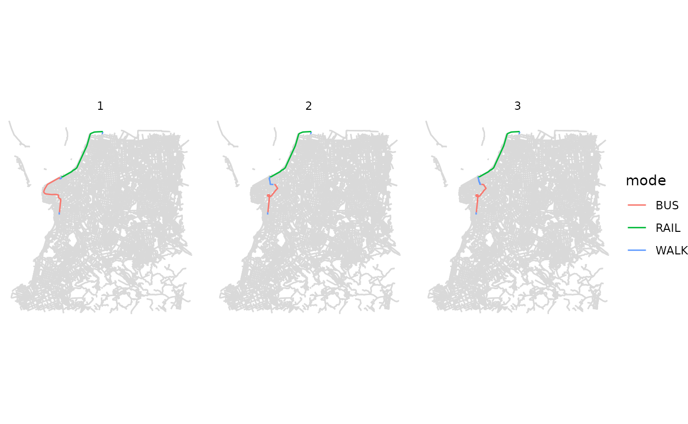

# Trip planning with detailed_itineraries()

Abstract

This vignette shows how to do route planning using the
[`detailed_itineraries()`](https://ipea.github.io/r5r/dev/reference/detailed_itineraries.md)
function in r5r.

## 1. Introduction

**r5r**’s routing and accessibility functions are very fast, but they
return only the essential information, and only the optimal route
(minimizing travel time and/or monetary cost). Sometimes, though, we
would like to do more simple route planning analysis and extract more
information for each route. Also, we might be interested in finding not
only the fastest route but some other suboptimal route alternatives too.
This is where the
[`detailed_itineraries()`](https://ipea.github.io/r5r/dev/reference/detailed_itineraries.md)
function comes in.
[`detailed_itineraries()`](https://ipea.github.io/r5r/dev/reference/detailed_itineraries.md)
returns, for each origin/destination pair, a detailed route plan per
leg, i.e. a part of the trip on a single mode, such as walking to the
bus stop (R5’s documentation calls legs ‘segments’). Each leg has its
mode, waiting time, travel time, distance and geometry. The function can
also return suboptimal route alternatives.

**obs.** Use
[`detailed_itineraries()`](https://ipea.github.io/r5r/dev/reference/detailed_itineraries.md)
only if you need suboptimal alternative routes and/or route geometries.
For route information by trip segment alone, we strongly recommend
[`expanded_travel_time_matrix()`](https://ipea.github.io/r5r/dev/reference/expanded_travel_time_matrix.md).

## 2. Build routable transport network with `build_network()`

We use the Porto Alegre (Brazil) sample data included in `r5r`.

``` r

# increase Java memory
options(java.parameters = "-Xmx2G")

# load libraries
library(r5r)
library(sf)
library(ggplot2)
library(data.table)

# build a routable transport network with r5r
data_path <- system.file("extdata/poa", package = "r5r")
r5r_network <- build_network(data_path)

# routing inputs
mode <- c('walk', 'transit')
max_trip_duration <- 60 # minutes

# departure time
departure_datetime <- as.POSIXct("13-05-2019 14:00:00", 
                                 format = "%d-%m-%Y %H:%M:%S")

# load origin/destination points
poi <- fread(file.path(data_path, "poa_points_of_interest.csv"))
```

## 3. Detailed info by trip segment for multiple trip alternatives

To get alternative routes between one origin/destination pair, set
`shortest_path = FALSE`. With `suboptimal_minutes = 8`, `r5r` also keeps
routes arriving up to 8 minutes after the optimal one.

``` r

# set inputs
origins <- poi[10,]
destinations <- poi[12,]
mode <- c("WALK", "TRANSIT")
max_walk_time <- 60
departure_datetime <- as.POSIXct("13-05-2019 14:00:00",
                                 format = "%d-%m-%Y %H:%M:%S")

# calculate detailed itineraries
det <- detailed_itineraries(
  r5r_network,
  origins = origins,
  destinations = destinations,
  mode = mode,
  departure_datetime = departure_datetime,
  max_walk_time = max_walk_time,
  suboptimal_minutes = 8,
  shortest_path = FALSE
  )

head(det)
#> Simple feature collection with 6 features and 16 fields
#> Geometry type: LINESTRING
#> Dimension:     XY
#> Bounding box:  xmin: -51.24094 ymin: -30.05 xmax: -51.19762 ymax: -29.99729
#> Geodetic CRS:  WGS 84
#>            from_id  from_lat  from_lon                          to_id    to_lat
#> 1 farrapos_station -29.99772 -51.19762 praia_de_belas_shopping_center -30.04995
#> 2 farrapos_station -29.99772 -51.19762 praia_de_belas_shopping_center -30.04995
#> 3 farrapos_station -29.99772 -51.19762 praia_de_belas_shopping_center -30.04995
#> 4 farrapos_station -29.99772 -51.19762 praia_de_belas_shopping_center -30.04995
#> 5 farrapos_station -29.99772 -51.19762 praia_de_belas_shopping_center -30.04995
#> 6 farrapos_station -29.99772 -51.19762 praia_de_belas_shopping_center -30.04995
#>      to_lon option departure_time total_duration total_distance segment mode
#> 1 -51.22875      1       14:07:57           35.6           9460       1 WALK
#> 2 -51.22875      1       14:07:57           35.6           9460       2 RAIL
#> 3 -51.22875      1       14:07:57           35.6           9460       3 WALK
#> 4 -51.22875      1       14:07:57           35.6           9460       4  BUS
#> 5 -51.22875      1       14:07:57           35.6           9460       5 WALK
#> 6 -51.22875      2       14:07:57           42.7           8773       1 WALK
#>   segment_duration wait distance  route                       geometry
#> 1              5.1  0.0      174        LINESTRING (-51.1981 -29.99...
#> 2              6.6  2.0     4796 LINHA1 LINESTRING (-51.19763 -29.9...
#> 3              4.0  0.0      256        LINESTRING (-51.22827 -30.0...
#> 4             10.4  4.4     4083    188 LINESTRING (-51.22926 -30.0...
#> 5              3.2  0.0      151        LINESTRING (-51.22949 -30.0...
#> 6              5.1  0.0      174        LINESTRING (-51.1981 -29.99...
```

The output is an `sf` data.frame, ready to map.

### 3.1 Visualize results

[`street_network_to_sf()`](https://ipea.github.io/r5r/dev/reference/street_network_to_sf.md)
extracts the OSM street network used in routing, to give the map
geographic context:

``` r

# extract OSM network
street_net <- r5r::street_network_to_sf(r5r_network)

# extract public transport network
transit_net <- r5r::transit_network_to_sf(r5r_network)

# plot
fig <- ggplot() +
        geom_sf(data = street_net$edges, color='gray85') +
        geom_sf(data = subset(det, option <4), aes(color=mode)) +
        facet_wrap(.~option) + 
        theme_void()

fig
```



## 4. Other options

- **All origins to all destinations:** by default,
  [`detailed_itineraries()`](https://ipea.github.io/r5r/dev/reference/detailed_itineraries.md)
  routes the 1st origin to the 1st destination, the 2nd to the 2nd, and
  so on. Set `all_to_all = TRUE` to route every origin to every
  destination.
- **No geometry:** set `drop_geometry = TRUE` to return results without
  the trip geometry. This makes the function faster.

## 5. Hack for frequency-based GTFS feeds

[`detailed_itineraries()`](https://ipea.github.io/r5r/dev/reference/detailed_itineraries.md)
does not work with frequency-based GTFS feeds. The workaround is to
convert frequencies to timetables with the [`gtfstools`
package](https://ipea.github.io/gtfstools/):

``` r

library(gtfstools)

# location of your frequency-based GTFS
freq_gtfs_file <- system.file("extdata/spo/spo.zip", package = "r5r")

# read GTFS data
freq_gtfs <- gtfstools::read_gtfs(freq_gtfs_file)

# convert from frequencies to time tables
stop_times_gtfs <- gtfstools::frequencies_to_stop_times(freq_gtfs)

# save it as a new GTFS.zip file
gtfstools::write_gtfs(gtfs = stop_times_gtfs,
                      path = tempfile(pattern = 'stop_times_gtfs', fileext = '.zip'))
```

[`write_gtfs()`](https://rdrr.io/pkg/gtfstools/man/write_gtfs.html)
saves the new feed to the `path` you give it (a temporary file above).
Put that file in your `data_path`, in place of the frequency-based feed,
and build the network.

#### Cleaning up after usage

Stop the network and run Java’s garbage collector to free the memory it
used:

``` r

r5r::stop_r5(r5r_network)
rJava::.jgc(R.gc = TRUE)
```

If you have any suggestions or want to report an error, please visit
[the package GitHub page](https://github.com/ipea/r5r).
