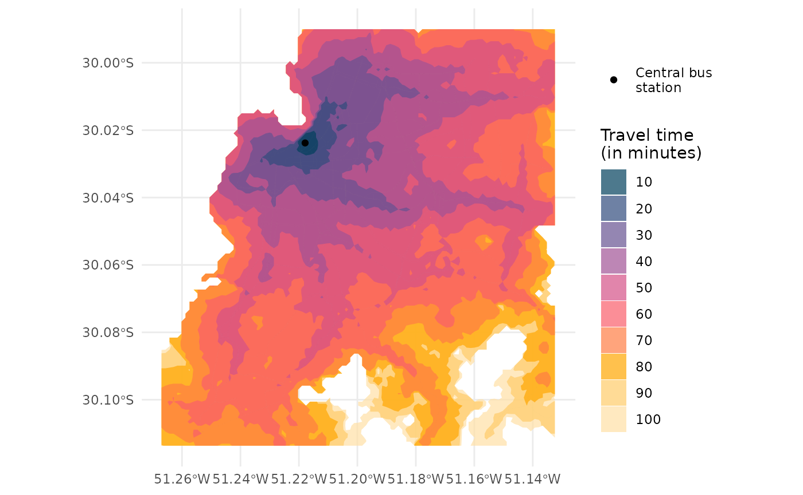
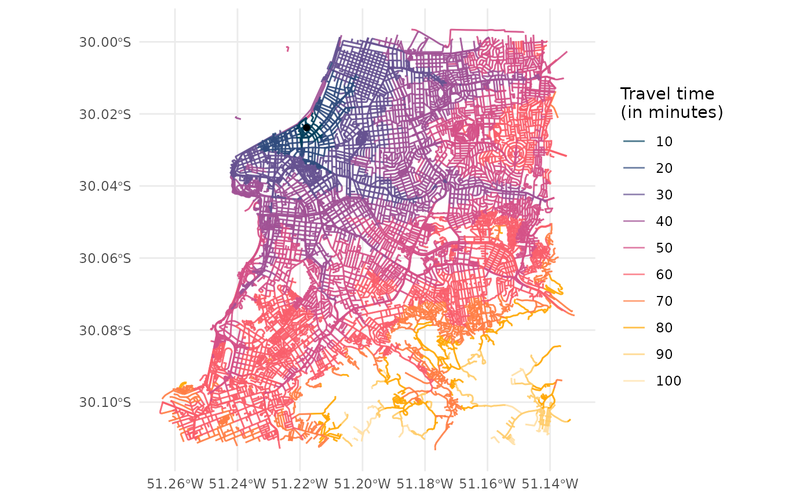

# Isochrones

Abstract

This vignette shows how to calculate and visualize isochrones in R using
the `r5r` package.

## 1. Introduction

An isochrone shows all areas reachable from a place within a maximum
travel time. This vignette uses the [`r5r`
package](https://ipea.github.io/r5r/index.html) and the Porto Alegre
(Brazil) sample data included in it to calculate and map public
transport isochrones from the city’s central bus station at several
travel time thresholds.
[`r5r::isochrone()`](https://ipea.github.io/r5r/dev/reference/isochrone.md)
builds both polygon- and line-based isochrones; we cover both.

***Warning:*** to count opportunities (e.g. jobs, schools or hospitals)
within each isochrone, we strongly recommend NOT using
[`isochrone()`](https://ipea.github.io/r5r/dev/reference/isochrone.md).
The [Accessibility
vignette](https://ipea.github.io/r5r/articles/accessibility.html) shows
much more efficient ways.

## 2. Build routable transport network with `build_network()`

#### Increase Java memory and load libraries

Set Java memory before loading the packages
([why](https://ipea.github.io/r5r/articles/r5r.html#usage)).

``` r

options(java.parameters = "-Xmx2G")

library(r5r)
library(sf)
library(data.table)
library(ggplot2)
```

[`build_network()`](https://ipea.github.io/r5r/dev/reference/build_network.md)
takes the directory holding the OpenStreetMap and GTFS data:

``` r

# system.file returns the directory with example data inside the r5r package
# set data path to directory containing your own data if not running this example
data_path <- system.file("extdata/poa", package = "r5r")

r5r_network <- build_network(data_path)
```

## 3. Calculating and visualizing isochrones

### 3.1 Polygon-based isochrones

Polygon-based isochrones are the most common: set
`polygon_output = TRUE`. The polygons are built on a regular grid of
[Web Mercator
pixels](https://docs.conveyal.com/analysis/methodology#spatial-resolution)
whose resolution is set by `zoom`. Higher zooms give more detailed
isochrones but take longer, and may fail with an error in large
networks. The default, 10, uses cells of 153 m at the Equator.

Below, isochrones use the median travel time of departures every minute
over a 60-minute window (2pm to 3pm).

``` r

# read all points in the city
points <- fread(file.path(data_path, "poa_hexgrid.csv"))

# subset point with the geolocation of the central bus station
central_bus_stn <- points[291,]

# isochrone intervals
time_intervals <- seq(0, 100, 10)

# routing inputs
mode <- c("WALK", "TRANSIT")
max_walk_time <- 30      # in minutes
time_window <- 60        # in minutes
departure_datetime <- as.POSIXct("13-05-2019 14:00:00",
                                 format = "%d-%m-%Y %H:%M:%S")

# calculate travel time matrix
iso1 <- r5r::isochrone(
  r5r_network,
  origins = central_bus_stn,
  mode = mode,
  polygon_output = TRUE, 
  cutoffs = time_intervals,
  departure_datetime = departure_datetime,
  max_walk_time = max_walk_time,
  time_window = time_window,
  progress = FALSE,
  zoom = 10
  )
```

[`isochrone()`](https://ipea.github.io/r5r/dev/reference/isochrone.md)
works like
[`travel_time_matrix()`](https://ipea.github.io/r5r/dev/reference/travel_time_matrix.md),
but with `polygon_output = TRUE` it returns an `sf` data.frame with one
`POLYGON`/`MULTIPOLYGON` per origin, cutoff and percentile:

``` r

head(iso1)
#> Simple feature collection with 6 features and 3 fields
#> Geometry type: MULTIPOLYGON
#> Dimension:     XY
#> Bounding box:  xmin: -51.26701 ymin: -30.11365 xmax: -51.13243 ymax: -29.99003
#> Geodetic CRS:  WGS 84
#>                id isochrone percentile                       polygons
#> 1 89a90128a8fffff       100        p50 MULTIPOLYGON (((-51.14891 -...
#> 2 89a90128a8fffff        90        p50 MULTIPOLYGON (((-51.16493 -...
#> 3 89a90128a8fffff        80        p50 MULTIPOLYGON (((-51.16814 -...
#> 4 89a90128a8fffff        70        p50 MULTIPOLYGON (((-51.17638 -...
#> 5 89a90128a8fffff        60        p50 MULTIPOLYGON (((-51.22444 -...
#> 6 89a90128a8fffff        50        p50 MULTIPOLYGON (((-51.22581 -...
```

Mapping the isochrones:

``` r

# extract OSM network
street_net <- street_network_to_sf(r5r_network)
main_roads <- subset(street_net$edges, street_class %like% 'PRIMARY|SECONDARY')
  
colors <- c('#ffe0a5','#ffcb69','#ffa600','#ff7c43','#f95d6a',
            '#d45087','#a05195','#665191','#2f4b7c','#003f5c')

ggplot() +
  geom_sf(data = iso1, aes(fill=factor(isochrone)), color = NA, alpha = .7) +
  geom_sf(data = main_roads, color = "gray55", size=0.01, alpha = 0.2) +
  geom_point(data = central_bus_stn, aes(x=lon, y=lat, color='Central bus\nstation')) +
  scale_fill_manual(values = rev(colors) ) +
  scale_color_manual(values=c('Central bus\nstation'='black')) +
  labs(fill = "Travel time\n(in minutes)", color='') +
  theme_minimal() +
  theme(axis.title = element_blank())
```

 \## 3.2
Line-based isochrones

For line-based isochrones, set `polygon_output = FALSE` (no `zoom`
needed). The output is a `LINESTRING` `sf` data.frame.

``` r

# calculate travel time matrix
iso2 <- r5r::isochrone(
  r5r_network,
  origins = central_bus_stn,
  mode = mode,
  polygon_output = FALSE, 
  cutoffs = time_intervals,
  departure_datetime = departure_datetime,
  max_walk_time = max_walk_time,
  time_window = time_window,
  progress = FALSE
  )

head(iso2)
#> Simple feature collection with 6 features and 14 fields
#> Geometry type: LINESTRING
#> Dimension:     XY
#> Bounding box:  xmin: -51.20291 ymin: -30.10872 xmax: -51.1844 ymax: -30.09557
#> Geodetic CRS:  WGS 84
#>                id edge_index    osm_id isochrone travel_time_p50 from_vertex
#> 1 89a90128a8fffff      32820 289389686       100              98        7464
#> 2 89a90128a8fffff      32821 289389686       100              98       14753
#> 3 89a90128a8fffff      34254 326021940       100              98       15308
#> 4 89a90128a8fffff      34255 326021940       100              98       15309
#> 5 89a90128a8fffff      35888 337865739       100              98       15671
#> 6 89a90128a8fffff      35889 337865739       100              98       15690
#>   to_vertex street_class  length  walk   car car_speed bicycle bicycle_lts
#> 1     14753        OTHER 374.345  TRUE  TRUE    39.996    TRUE           2
#> 2      7464        OTHER 374.345  TRUE  TRUE    39.996    TRUE           2
#> 3     15309        OTHER 227.438  TRUE FALSE    40.248    TRUE           1
#> 4     15308        OTHER 227.438  TRUE FALSE    40.248    TRUE           1
#> 5     15690        OTHER  87.668 FALSE FALSE    40.248   FALSE           1
#> 6     15671        OTHER  87.668 FALSE FALSE    40.248   FALSE           1
#>                         geometry
#> 1 LINESTRING (-51.19973 -30.1...
#> 2 LINESTRING (-51.20291 -30.1...
#> 3 LINESTRING (-51.1844 -30.10...
#> 4 LINESTRING (-51.18581 -30.1...
#> 5 LINESTRING (-51.19704 -30.0...
#> 6 LINESTRING (-51.19686 -30.0...
```

Mapping the isochrones:

``` r

ggplot() +
  geom_sf(data = iso2, aes(color=factor(isochrone)), alpha = .7) +
  scale_color_manual(values = rev(colors) ) +
  geom_point(data = central_bus_stn, aes(x=lon, y=lat), color='black') +
  labs(color = "Travel time\n(in minutes)") +
  theme_minimal() +
  theme(axis.title = element_blank())
```



#### Cleaning up after usage

Stop the network and run Java’s garbage collector to free the memory it
used:

``` r

r5r::stop_r5(r5r_network)
rJava::.jgc(R.gc = TRUE)
```

If you have any suggestions or want to report an error, please visit
[the package GitHub page](https://github.com/ipea/r5r).
