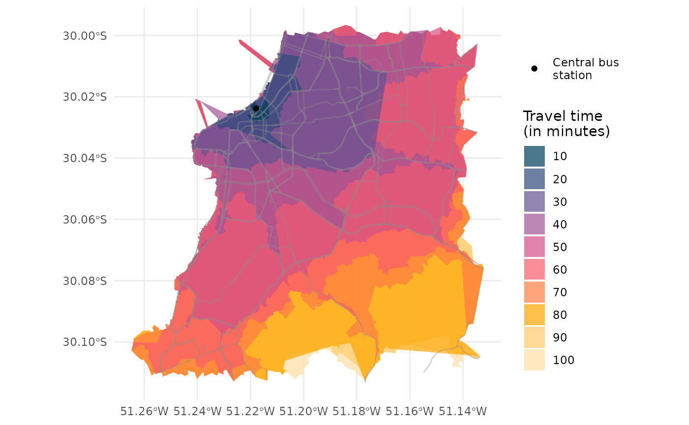

# Isochrones

Abstract

This vignette shows how to calculate and visualize isochrones in R using
the `r5r` package.

## 1. Introduction

An isochrone map shows how far one can travel from a given place within
a certain amount of time. In other other words, it shows all the areas
reachable from that place within a maximum travel time. This vignette
shows how to calculate and visualize isochrones in R using the [`r5r`
package](https://ipeagit.github.io/r5r/index.html) using a reproducible
example. In this example, we will be using a sample data set for the
city of Porto Alegre (Brazil) included in `r5r`. Our aim here is to
calculate several isochrones departing from the central bus station
given different travel time thresholds.

The
[`r5r::isochrone()`](https://ipeagit.github.io/r5r/dev/reference/isochrone.md)
function allows you to build both polygon- and line-based isochrones. We
will cover both approaches in this vignette, where we will be
calculating isochrones by public transport from the central bus station
in Porto Alegre.

Before we start, we need to increase Java memory + load a few libraries,
and to  
build routable transport network.

***Warning:*** If you want to calculate how many opportunities
(e.g. jobs, or schools or hospitals) are located inside each isochrone,
we strongly recommend you NOT to use the
[`isochrone()`](https://ipeagit.github.io/r5r/dev/reference/isochrone.md)
function. You will find much more efficient ways to do this in the
[Accessibility
vignette](https://ipeagit.github.io/r5r/articles/accessibility.html).

## 2. Build routable transport network with `build_network()`

#### Increase Java memory and load libraries

First, we need to increase the memory available to Java and load the
packages used in this vignette. Please note we allocate RAM memory to
Java *before* loading our libraries.

``` r
options(java.parameters = "-Xmx2G")

library(r5r)
library(sf)
library(data.table)
library(ggplot2)
```

To build a routable transport network with `r5r`, the user needs to call
[`build_network()`](https://ipeagit.github.io/r5r/dev/reference/build_network.md)
with the path to the directory where OpenStreetMap and GTFS data are
stored.

``` r
# system.file returns the directory with example data inside the r5r package
# set data path to directory containing your own data if not running this example
data_path <- system.file("extdata/poa", package = "r5r")

r5r_network <- build_network(data_path)
```

## 3. Calculating and visualizing isochrones

### 3.1 Polygon-based isochrones

The most common approach here is to create polygon-based isochrones. To
do this, you need to pass the arguments `polygon_output = TRUE` and
choose the `zoom` level. The polygon-based isochrone in {r5r} are built
on top of a regular grid based on [Web Mercator
pixels](https://docs.conveyal.com/analysis/methodology#spatial-resolution).
The zoom level can be controlled with the `zoom` parameter; higher zooms
lead to more detailed isochrones at the expense of computational time.
The default is 10 (which uses cells of 153m at the Equator). In large
networks, high zooms may not be possible and will give an error.

With the code below, `r5r` determines the isochrones considering the
median travel time of multiple travel time estimates calculated
departing every minute over a 60-minute time window, between 2pm and
4pm.

``` r
# read all points in the city
points <- fread(file.path(data_path, "poa_hexgrid.csv"))

# subset point with the geolocation of the central bus station
central_bus_stn <- points[291,]

# isochrone intervals
time_intervals <- seq(0, 100, 10)

# routing inputs
mode <- c("WALK", "TRANSIT")
max_walk_time <- 30      # in minutes
max_trip_duration <- 90  # in minutes
time_window <- 60        # in minutes
departure_datetime <- as.POSIXct("13-05-2019 14:00:00",
                                 format = "%d-%m-%Y %H:%M:%S")

# calculate travel time matrix
iso1 <- r5r::isochrone(
  r5r_network,
  origins = central_bus_stn,
  mode = mode,
  polygon_output = TRUE, 
  cutoffs = time_intervals,
  departure_datetime = departure_datetime,
  max_walk_time = max_walk_time,
  max_trip_duration = max_trip_duration,
  time_window = time_window,
  progress = FALSE,
  zoom = 10
  )
```

As you can see, the
[`isochrone()`](https://ipeagit.github.io/r5r/dev/reference/isochrone.md)
functions works very similarly to the
[`travel_time_matrix()`](https://ipeagit.github.io/r5r/dev/reference/travel_time_matrix.md)
function. However, instead of returning a table with travel time
estimates, it returns a `POLYGON "sf" "data.frame"` for each isochrone
of each origin when you set `polygon_output = TRUE`.

``` r
head(iso1)
#> Simple feature collection with 6 features and 3 fields
#> Geometry type: MULTIPOLYGON
#> Dimension:     XY
#> Bounding box:  xmin: -51.2677 ymin: -30.11306 xmax: -51.13312 ymax: -29.98943
#> Geodetic CRS:  WGS 84
#>                id isochrone percentile                       polygons
#> 1 89a90128a8fffff       100        p50 MULTIPOLYGON (((-51.1496 -3...
#> 2 89a90128a8fffff        90        p50 MULTIPOLYGON (((-51.16608 -...
#> 3 89a90128a8fffff        80        p50 MULTIPOLYGON (((-51.16745 -...
#> 4 89a90128a8fffff        70        p50 MULTIPOLYGON (((-51.17569 -...
#> 5 89a90128a8fffff        60        p50 MULTIPOLYGON (((-51.22498 -...
#> 6 89a90128a8fffff        50        p50 MULTIPOLYGON (((-51.22787 -...
```

Now it becomes super simple to visualize our isochrones on a map:

``` r
# extract OSM network
street_net <- street_network_to_sf(r5r_network)
main_roads <- subset(street_net$edges, street_class %like% 'PRIMARY|SECONDARY')
  
colors <- c('#ffe0a5','#ffcb69','#ffa600','#ff7c43','#f95d6a',
            '#d45087','#a05195','#665191','#2f4b7c','#003f5c')

ggplot() +
  geom_sf(data = iso1, aes(fill=factor(isochrone)), color = NA, alpha = .7) +
  geom_sf(data = main_roads, color = "gray55", size=0.01, alpha = 0.2) +
  geom_point(data = central_bus_stn, aes(x=lon, y=lat, color='Central bus\nstation')) +
  scale_fill_manual(values = rev(colors) ) +
  scale_color_manual(values=c('Central bus\nstation'='black')) +
  labs(fill = "Travel time\n(in minutes)", color='') +
  theme_minimal() +
  theme(axis.title = element_blank())
```

 \## 3.1
Line-based isochrones

Alternatively, you can build line-based isochrones by simply passing
`polygon_output = FALSE` to the
[`isochrone()`](https://ipeagit.github.io/r5r/dev/reference/isochrone.md)
function. Note that you do not need the `zoom` parameter here, and that
the output is `LINESTRING "sf" "data.frame"`.

``` r
# calculate travel time matrix
iso2 <- r5r::isochrone(
  r5r_network,
  origins = central_bus_stn,
  mode = mode,
  polygon_output = FALSE, 
  cutoffs = time_intervals,
  departure_datetime = departure_datetime,
  max_walk_time = max_walk_time,
  max_trip_duration = max_trip_duration,
  time_window = time_window,
  progress = FALSE
  )
#> Warning: st_centroid assumes attributes are constant over geometries

head(iso2)
#> Simple feature collection with 6 features and 13 fields
#> Geometry type: LINESTRING
#> Dimension:     XY
#> Bounding box:  xmin: -51.20291 ymin: -30.10872 xmax: -51.1844 ymax: -30.09557
#> Geodetic CRS:  WGS 84
#>   edge_index    osm_id isochrone travel_time_p50 from_vertex to_vertex
#> 1      32820 289389686       100              98        7464     14753
#> 2      32821 289389686       100              98       14753      7464
#> 3      34254 326021940       100              97       15308     15309
#> 4      34255 326021940       100              97       15309     15308
#> 5      35888 337865739       100              97       15671     15690
#> 6      35889 337865739       100              97       15690     15671
#>   street_class  length  walk   car car_speed bicycle bicycle_lts
#> 1        OTHER 374.345  TRUE  TRUE    39.996    TRUE           2
#> 2        OTHER 374.345  TRUE  TRUE    39.996    TRUE           2
#> 3        OTHER 227.438  TRUE FALSE    40.248    TRUE           1
#> 4        OTHER 227.438  TRUE FALSE    40.248    TRUE           1
#> 5        OTHER  87.668 FALSE FALSE    40.248   FALSE           1
#> 6        OTHER  87.668 FALSE FALSE    40.248   FALSE           1
#>                         geometry
#> 1 LINESTRING (-51.19973 -30.1...
#> 2 LINESTRING (-51.20291 -30.1...
#> 3 LINESTRING (-51.1844 -30.10...
#> 4 LINESTRING (-51.18581 -30.1...
#> 5 LINESTRING (-51.19704 -30.0...
#> 6 LINESTRING (-51.19686 -30.0...
```

Now it becomes super simple to visualize our isochrones on a map:

``` r
ggplot() +
  geom_sf(data = iso2, aes(color=factor(isochrone)), alpha = .7) +
  scale_color_manual(values = rev(colors) ) +
  geom_point(data = central_bus_stn, aes(x=lon, y=lat), color='black') +
  labs(color = "Travel time\n(in minutes)", color='sadasd') +
  theme_minimal() +
  theme(axis.title = element_blank())
```


#### Cleaning up after usage

`r5r` objects are still allocated to any amount of memory previously set
after they are done with their calculations. In order to remove an
existing `r5r` object and reallocate the memory it had been using, we
use the `stop_r5` function followed by a call to Java’s garbage
collector, as follows:

``` r
r5r::stop_r5(r5r_network)
rJava::.jgc(R.gc = TRUE)
```

If you have any suggestions or want to report an error, please visit
[the package GitHub page](https://github.com/ipeaGIT/r5r).
