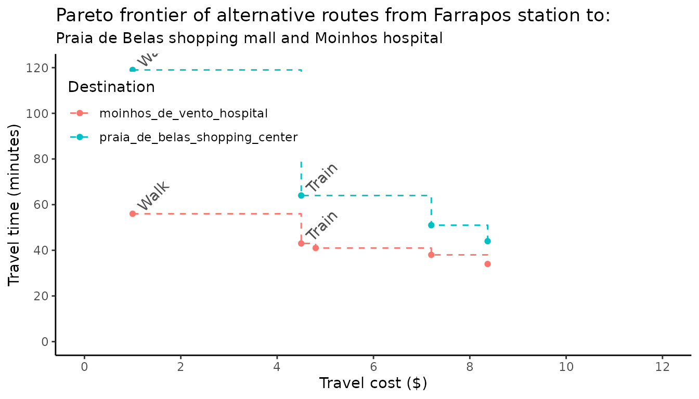

# Trade-offs between travel time and monetary cost

Abstract

This vignette shows how to use the
[`pareto_frontier()`](https://ipeagit.github.io/r5r/dev/reference/pareto_frontier.md)
function to examine the trade-offs between travel time and monetary cost
in travel time matrices in r5r.

## 1. Introduction

In most cases, transport routing models find either the fastest or the
lowest-cost routes that connect places in a given transport network.
Sometimes, though, we might want a more sophisticated analysis that
considers both the time and monetary costs that public transport
passengers have to face. The problem here is that simultaneously
accounting for both time and monetary costs is a major challenge for
routing models because of the trade-offs between the objectives of
minimizing trip duration and cost (Conway and Stewart 2019).

To address this problem, `r5r` has a function called
[`pareto_frontier()`](https://ipeagit.github.io/r5r/dev/reference/pareto_frontier.md),
which calculates the most efficient route possibilities between origin
destination pairs considering multiple combinations of travel time and
monetary costs. This vignette uses a reproducible example to demonstrate
how to use
[`pareto_frontier()`](https://ipeagit.github.io/r5r/dev/reference/pareto_frontier.md)
and interpret its results.

### 2. What the `pareto_frontier` means.

Imagine a hypothetical journey from A to B. There are multiple route
alternatives between this origin and destination with varying
combinations of travel time and cost (figure below).

- Walking from A to B would be the **cheapest** option but it would take
  50 minutes.
- The **fastest** option would be to take a bus to a subway station and
  transfer to the subway. This option would only take 15 minutes, but it
  would cost \$8.
- There are some intermediary alternatives, such as taking:
  - a single bus, \$3 for 35 min.
  - two buses with one transfer, \$5 for 29 min.
  - taking the subway after walking to the station , \$6 for 20 min.

This figure illustrates the Pareto frontier of alternative routes from A
to B. In other words, it shows the most optimal set of route
alternatives between A and B. There are certainly other route options,
but there is no other option that is both faster and cheaper at the same
time.


  

This kind of abstraction allows us to have a better grasp of the
trade-offs between travel time and monetary cost passengers face when
using public transport. It also allows us to calculate
cumulative-opportunity accessibility metrics with cutoffs for both time
and cost (e.g. the number of jobs reachable from a given origin with
limits of 40 minutes and \$5) (ref paper by Matt and Anson).

Let’s see a couple concrete examples showing how `r5r` can calculate the
Pareto frontier for multiple origins.

### 3. Demonstration of `pareto_frontier()`.

#### 3.1 Build routable transport network with `build_network()`

First, let’s build the network and create the routing inputs. In this
example we’ll be using the a sample data set for the city of Porto
Alegre (Brazil) included in `r5r`.

``` r
# increase Java memory
options(java.parameters = "-Xmx2G")

# load libraries
library(r5r)
library(data.table)
library(ggplot2)
library(dplyr)

# build a routable transport network with r5r
data_path <- system.file("extdata/poa", package = "r5r")
r5r_network <- build_network(data_path)

# routing inputs
mode <- c('walk', 'transit')
max_trip_duration <- 90 # minutes

# load origin/destination points of interest
points <- fread(file.path(data_path, "poa_points_of_interest.csv"))
```

#### 3.2 Set up the fare structure

Now we need to set what are the fare rules of our public transport
system. These rules will be used by `R5` to calculate the monetary cost
of alternative routes. In the case of Porto Alegre, the fare rules are
as follows: \* Each bus ticket costs R\$ 4.80. \* Riding a second bus
adds `$` 2.40 to the total cost. Subsequent bus rides cost the full
ticket price of \$ 4.80. \* Each train ticket costs \$ 4.50. Once a
passenger enters a train station, she can take an unlimited amount of
train trips as long as she doesn’t leave a station. \* The integrated
fare between bus and train has a 10% discount, which totals \$ 8.37.

We can create `list` object with these fare rules with the support of
the
[`setup_fare_structure()`](https://ipeagit.github.io/r5r/dev/reference/setup_fare_structure.md)
function as shown in the code below. A detailed explanation of how to
use the fare structure of `5r5` can be found in [(this other
vignette)](https://ipeagit.github.io/r5r/articles/fare_structure.html).

``` r
# create basic fare structure
fare_structure <- setup_fare_structure(
  r5r_network, 
  base_fare = 4.8,
  by = "MODE"
  )

# update the cost of bus and train fares
fare_structure$fares_per_type[, fare := fcase(type == "BUS", 4.80,
                                             type == "RAIL", 4.50)]

# update the cost of tranfers
fare_structure$fares_per_transfer[, fare := fcase(first_leg == "BUS" & second_leg == "BUS", 7.2,
                                                 first_leg != second_leg, 8.37)]

# update transfer_time_allowance to 60 minutes
fare_structure$transfer_time_allowance <- 60

fare_structure$fares_per_type[type == "RAIL", unlimited_transfers := TRUE]
fare_structure$fares_per_type[type == "RAIL", allow_same_route_transfer := TRUE]
```

For convenience, we can save these fare rules as a `zip` file and load
again for a future application.

``` r
# save fare rules to temp file
temp_fares <- tempfile(pattern = "fares_poa", fileext = ".zip")
r5r::write_fare_structure(fare_structure, file_path = temp_fares)


fare_structure <- r5r::read_fare_structure(file.path(data_path, "fares/fares_poa.zip"))
```

#### 3.3 Calculating a `pareto_frontier()`.

In this example, we calculate the Pareto frontier from all origins to
all destinations considering multiple cutoffs of monetary costs:

- \$1, which would only allow for walking trips
- \$4.5, which would only allow for rail trips
- \$4.8, which would allow for a single bus trip
- \$7.20, which would allow for bus + bus
- \$8.37, which would allow for walking walking + bus + rail

``` r
departure_datetime <- as.POSIXct("13-05-2019 14:00:00", 
                                 format = "%d-%m-%Y %H:%M:%S")

prtf <- pareto_frontier(
  r5r_network,
  origins = points,
  destinations = points,
  mode = c("WALK", "TRANSIT"),
  departure_datetime = departure_datetime,
  fare_structure = fare_structure,
  fare_cutoffs = c(1, 4.5, 4.8, 7.20, 8.37),
  progress = TRUE
  )
#> Loading required namespace: testthat

head(prtf)
#>          from_id               to_id percentile travel_time monetary_cost
#>           <char>              <char>      <int>       <int>         <num>
#> 1: public_market       public_market         50           0           1.0
#> 2: public_market bus_central_station         50          21           1.0
#> 3: public_market bus_central_station         50          16           4.5
#> 4: public_market bus_central_station         50          13           4.8
#> 5: public_market    gasometer_museum         50          26           1.0
#> 6: public_market    gasometer_museum         50          12           4.8
```

For the sake of illustration, let’s check the optimum route alternatives
from the Farrapos train station to (a) the Praia de Belas shopping mall
and (b) the Moinhos hospital. An optimum route alternative means that
one cannot make a faster trip without increasing costs, and one cannot
make a cheaper trip without increasing travel time.



#### Cleaning up after usage

`r5r` objects are still allocated to any amount of memory previously set
after they are done with their calculations. In order to remove an
existing `r5r` object and reallocate the memory it had been using, we
use the `stop_r5` function followed by a call to Java’s garbage
collector, as follows:

``` r
r5r::stop_r5(r5r_network)
rJava::.jgc(R.gc = TRUE)
```

If you have any suggestions or want to report an error, please visit
[the package GitHub page](https://github.com/ipeaGIT/r5r).

### References

Conway, Matthew Wigginton, and Anson F. Stewart. 2019. “Getting Charlie
Off the MTA: A Multiobjective Optimization Method to Account for Cost
Constraints in Public Transit Accessibility Metrics.” *International
Journal of Geographical Information Science* 33 (9): 1759–87.
<https://doi.org/10.1080/13658816.2019.1605075>.
