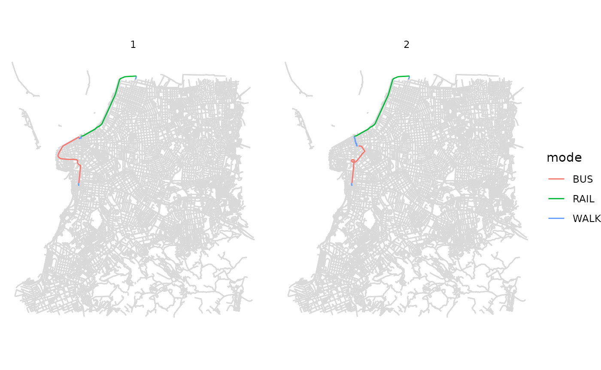

# Intro to r5r: Rapid Realistic Routing with R5 in R

Abstract

[r5r](https://github.com/ipeaGIT/r5r) is an R package for rapid
realistic routing on multimodal transport networks (walk, bike, public
transport and car) using R⁵. The package allows users to generate
detailed routing analysis or calculate travel time matrices using
seamless parallel computing on top of the R⁵ Java machine
<https://github.com/conveyal/r5>

## 1. Introduction

**r5r** is an [R package for rapid realistic routing on multimodal
transport networks](https://github.com/ipeaGIT/r5r) (walk, bike, public
transport and car). It provides a simple and friendly interface to R⁵, a
really fast and open source Java-based routing engine developed
separately by [Conveyal](https://www.conveyal.com/). R⁵ stands for
[Rapid Realistic Routing on Real-world and Reimagined
networks](https://github.com/conveyal/r5). More details about **r5r**
can be found on the [package
webpage](https://ipeagit.github.io/r5r/index.html) or on this
[paper](https://doi.org/10.32866/001c.21262).

## 2. Installation

You can install [r5r](https://github.com/ipeaGIT/r5r) from CRAN, or the
development version from github.

``` r
# from CRAN
install.packages('r5r')

# dev version with latest features
devtools::install_github("ipeaGIT/r5r", subdir = "r-package")
```

Please bear in mind that you need to have *Java Development Kit (JDK)
21* installed on your computer to use
[r5r](https://github.com/ipeaGIT/r5r). No worries, you don’t have to pay
for it. There are numerous open-source JDK implementations, and you only
need to install one JDK. Here are a few options:

- [Adoptium/Eclipse Temurin](https://adoptium.net/) (our preferred
  option)
- [Amazon Corretto](https://aws.amazon.com/corretto/)
- [Oracle OpenJDK](https://jdk.java.net/21/).

The easiest way to install JDK is using the new
[{rJavaEnv}](https://www.ekotov.pro/rJavaEnv/) package in R:

``` r
# install {rJavaEnv} from CRAN
install.packages("rJavaEnv")

# check version of Java currently installed (if any) 
rJavaEnv::java_check_version_rjava()

## if this is the first time you use {rJavaEnv}, you might need to run this code
## below to consent the installation of Java.
# rJavaEnv::rje_consent(provided = TRUE)

# install Java 21
rJavaEnv::java_quick_install(version = 21)

# check if Java was successfully installed
rJavaEnv::java_check_version_rjava()
```

## 3. Usage

First, we need to increase the memory available to Java. This has to be
done **before** loading the [r5r](https://github.com/ipeaGIT/r5r)
library because, by default, `R` allocates only 512MB of memory for Java
processes, which is not enough for large queries using
[r5r](https://github.com/ipeaGIT/r5r). To increase available memory to
2GB, for example, we need to set the `java.parameters` option at the
beginning of the script, as follows:

``` r
options(java.parameters = "-Xmx2G")

# By default, {r5r} uses all CPU cores available. If you want to limit the 
# number of CPUs to 4, for example, you can run:  
options(java.parameters = c("-Xmx2G", "-XX:ActiveProcessorCount=4"))
```

Note: It’s very important to allocate enough memory before loading
[r5r](https://github.com/ipeaGIT/r5r) or any other Java-based package,
since `rJava` starts a Java Virtual Machine only once for each R
session. It might be useful to restart your R session and execute the
code above right after, if you notice that you haven’t succeeded in your
previous attempts.

Then we can load the packages used in this vignette:

``` r
library(r5r)
library(sf)
library(data.table)
library(ggplot2)
```

The [r5r](https://github.com/ipeaGIT/r5r) package has seven
**fundamental functions**:

1.  [`build_network()`](https://ipeagit.github.io/r5r/dev/reference/build_network.md)
    to build a routable transport network;

2.  [`accessibility()`](https://ipeagit.github.io/r5r/dev/reference/accessibility.md)
    for fast computation of access to opportunities considering a
    selected decay function;

3.  [`travel_time_matrix()`](https://ipeagit.github.io/r5r/dev/reference/travel_time_matrix.md)
    for fast computation of travel time estimates between
    origin/destination pairs considering departure time;

4.  [`arrival_travel_time_matrix()`](https://ipeagit.github.io/r5r/dev/reference/arrival_travel_time_matrix.md)
    for calculating travel time matrices between origin destination
    pairs considering a time of arrival. The output includes additional
    information such as the routes used and total time disaggregated by
    access, waiting, in-vehicle and transfer times.

5.  [`expanded_travel_time_matrix()`](https://ipeagit.github.io/r5r/dev/reference/expanded_travel_time_matrix.md)
    for calculating travel matrices between origin destination pairs
    with additional information such as routes used and total time
    disaggregated by access, waiting, in-vehicle and transfer times.

6.  [`detailed_itineraries()`](https://ipeagit.github.io/r5r/dev/reference/detailed_itineraries.md)
    to get detailed information on one or multiple alternative routes
    between origin/destination pairs.

7.  [`pareto_frontier()`](https://ipeagit.github.io/r5r/dev/reference/pareto_frontier.md)
    for analyzing the trade-off between the travel time and monetary
    costs of multiple route alternatives between origin/destination
    pairs.

8.  [`isochrone()`](https://ipeagit.github.io/r5r/dev/reference/isochrone.md)
    to estimate the polygons of the areas that can be reached from an
    origin point at different travel time limits.

Most of these functions also allow users to account for monetary travel
costs when generating travel time matrices and accessibility estimates.
More info about how to consider monetary costs can be found in [this
vignette](https://ipeagit.github.io/r5r/articles/fare_structure.html).

The package also includes a few **support functions**.

1.  [`street_network_to_sf()`](https://ipeagit.github.io/r5r/dev/reference/street_network_to_sf.md)
    to extract OpenStreetMap network in sf format from a `network.dat`
    file.

2.  [`transit_network_to_sf()`](https://ipeagit.github.io/r5r/dev/reference/transit_network_to_sf.md)
    to extract transit network in sf format from a `network.dat` file.

3.  [`find_snap()`](https://ipeagit.github.io/r5r/dev/reference/find_snap.md)
    to find snapped locations of input points on street network.

4.  [`r5r_sitrep()`](https://ipeagit.github.io/r5r/dev/reference/r5r_sitrep.md)
    to generate a situation report to help debug eventual errors.

### 3.1 Data requirements:

To use [r5r](https://github.com/ipeaGIT/r5r), you will need:

- A road network data set from OpenStreetMap in `.pbf` format
  (*mandatory*)
- A public transport feed in `GTFS.zip` format (optional)
- A raster file of Digital Elevation Model data in `.tif` format
  (optional)

Here are a few places from where you can download these data sets:

- OpenStreetMap
  - [osmextract](https://docs.ropensci.org/osmextract/) R package
  - [geofabrik](https://download.geofabrik.de/) website
  - [hot export tool](https://export.hotosm.org/) website
  - [BBBike.org](https://extract.bbbike.org/) website
- GTFS
  - [tidytransit](https://r-transit.github.io/tidytransit/) R package
  - [transitland](https://www.transit.land/) website
  - [Mobility Database](https://database.mobilitydata.org/) website
- Elevation
  - [elevatr](https://github.com/USEPA/elevatr) R package
  - Nasa’s SRTMGL1 website

Let’s have a quick look at how [r5r](https://github.com/ipeaGIT/r5r)
works using a sample data set.

## 4. Demonstration on sample data

### Data

To illustrate the functionalities of
[r5r](https://github.com/ipeaGIT/r5r), the package includes a small
sample data for the city of Porto Alegre (Brazil). It includes seven
files:

- An OpenStreetMap network: `poa_osm.pbf`
- Two public transport feeds: `poa_eptc.zip` and `poa_trensurb.zip`
- A raster elevation data: `poa_elevation.tif`
- A `poa_hexgrid.csv` file with spatial coordinates of a regular
  hexagonal grid covering the sample area, which can be used as
  origin/destination pairs in a travel time matrix calculation.
- A `poa_points_of_interest.csv` file containing the names and spatial
  coordinates of 15 places within Porto Alegre
- A `fares_poa.zip` file with the fare rules of the city’s public
  transport system.

``` r
data_path <- system.file("extdata/poa", package = "r5r")
list.files(data_path)
#>  [1] "fares"                      "network_settings.json"     
#>  [3] "network.dat"                "poa_elevation.tif"         
#>  [5] "poa_eptc.zip"               "poa_hexgrid.csv"           
#>  [7] "poa_ls_lts.rds"             "poa_osm_congestion.csv"    
#>  [9] "poa_osm_lts.csv"            "poa_osm.pbf"               
#> [11] "poa_osm.pbf.mapdb"          "poa_osm.pbf.mapdb.p"       
#> [13] "poa_points_of_interest.csv" "poa_poly_congestion.rds"   
#> [15] "poa_trensurb.zip"           "r5r-log.log"
```

The points of interest data can be seen below. In this example, we will
be looking at transport alternatives between some of those places.

``` r
poi <- fread(file.path(data_path, "poa_points_of_interest.csv"))
head(poi)
#>                     id       lat       lon
#>                 <char>     <num>     <num>
#> 1:       public_market -30.02756 -51.22781
#> 2: bus_central_station -30.02329 -51.21886
#> 3:    gasometer_museum -30.03404 -51.24095
#> 4: santa_casa_hospital -30.03043 -51.22240
#> 5:            townhall -30.02800 -51.22865
#> 6:     piratini_palace -30.03363 -51.23068
```

The data with origin destination pairs is shown below. In this example,
we will be using 200 points randomly selected from this data set.

``` r
points <- fread(file.path(data_path, "poa_hexgrid.csv"))

# sample points
sampled_rows <- sample(1:nrow(points), 200, replace=TRUE)
points <- points[ sampled_rows, ]
head(points)
#>                 id       lon       lat population schools  jobs healthcare
#>             <char>     <num>     <num>      <int>   <int> <int>      <int>
#> 1: 89a90128427ffff -51.20502 -30.08176        709       0     7          0
#> 2: 89a9012980fffff -51.17212 -30.02075       2073       0   127          0
#> 3: 89a90128043ffff -51.18627 -30.06949         21       1   100          0
#> 4: 89a9012828fffff -51.17700 -30.06612        965       0   219          0
#> 5: 89a90128657ffff -51.16852 -30.08209        678       0     0          0
#> 6: 89a9012826bffff -51.16740 -30.05445        240       1   180          0
```

### 4.1 Building routable transport network with `build_network()`

The first step is to build the multimodal transport network used for
routing in R⁵. This is done with the `build_network` function. This
function does two things: (1) downloads/updates a compiled JAR file of
R⁵ and stores it locally in the [r5r](https://github.com/ipeaGIT/r5r)
package directory for future use; and (2) combines the osm.pbf and
gtfs.zip data sets to build a routable network object.

``` r
# Indicate the path where OSM and GTFS data are stored
r5r_network <- build_network(data_path = data_path)
```

### 4.2 Accessibility analysis

The fastest way to calculate accessibility estimates is using the
[`accessibility()`](https://ipeagit.github.io/r5r/dev/reference/accessibility.md)
function. In this example, we calculate the number of schools and health
care facilities accessible in less than 60 minutes by public transport
and walking. More details in this vignette on [Calculating and
visualizing
Accessibility](https://ipeagit.github.io/r5r/articles/accessibility.html).

``` r
# set departure datetime input
departure_datetime <- as.POSIXct("13-05-2019 14:00:00",
                                 format = "%d-%m-%Y %H:%M:%S")

# calculate accessibility
access <- accessibility(
  r5r_network,
  origins = points,
  destinations = points,
  opportunities_colnames = c("schools", "healthcare"),
  mode = c("WALK", "TRANSIT"),
  departure_datetime = departure_datetime,
  decay_function = "step",
  cutoffs = 60
  )

head(access)
#>                 id opportunity percentile cutoff accessibility
#>             <char>      <char>      <int>  <int>         <num>
#> 1: 89a90128427ffff     schools         50     60            26
#> 2: 89a90128427ffff  healthcare         50     60            34
#> 3: 89a9012980fffff     schools         50     60            23
#> 4: 89a9012980fffff  healthcare         50     60            28
#> 5: 89a90128043ffff     schools         50     60            30
#> 6: 89a90128043ffff  healthcare         50     60            37
```

### 4.3 Routing analysis

For fast routing analysis, **r5r** currently has three core functions:
[`travel_time_matrix()`](https://ipeagit.github.io/r5r/dev/reference/travel_time_matrix.md),
[`expanded_travel_time_matrix()`](https://ipeagit.github.io/r5r/dev/reference/expanded_travel_time_matrix.md)
and
[`detailed_itineraries()`](https://ipeagit.github.io/r5r/dev/reference/detailed_itineraries.md).

#### Fast many to many travel time matrix

The
[`travel_time_matrix()`](https://ipeagit.github.io/r5r/dev/reference/travel_time_matrix.md)
function is a really simple and fast function to compute travel time
estimates between one or multiple origin/destination pairs. The
origin/destination input can be either a spatial `sf POINT` object, or a
`data.frame` containing the columns `id, lon, lat`. The function also
receives as inputs the *max walking distance*, in meters, and the *max
trip duration*, in minutes. Resulting travel times are also output in
minutes.

This function also allows users to very efficiently capture the travel
time uncertainties inside a given time window considering multiple
departure times. [More info on this
vignette](https://ipeagit.github.io/r5r/articles/time_window.html).

``` r
# set inputs
mode <- c("WALK", "TRANSIT")
max_walk_time <- 30 # minutes
max_trip_duration <- 120 # minutes
departure_datetime <- as.POSIXct("13-05-2019 14:00:00",
                                 format = "%d-%m-%Y %H:%M:%S")

# calculate a travel time matrix
ttm <- travel_time_matrix(
  r5r_network,
  origins = poi,
  destinations = poi,
  mode = mode,
  departure_datetime = departure_datetime,
  max_walk_time = max_walk_time,
  max_trip_duration = max_trip_duration
  )

head(ttm)
#>          from_id               to_id travel_time_p50
#>           <char>              <char>           <int>
#> 1: public_market       public_market               0
#> 2: public_market bus_central_station              13
#> 3: public_market    gasometer_museum              12
#> 4: public_market santa_casa_hospital              13
#> 5: public_market            townhall               3
#> 6: public_market     piratini_palace              14
```

#### Expanded travel time matrix with minute-by-minute estimates

For those interested in more detailed outputs, the
[`expanded_travel_time_matrix()`](https://ipeagit.github.io/r5r/dev/reference/expanded_travel_time_matrix.md)
works very similarly with
[`travel_time_matrix()`](https://ipeagit.github.io/r5r/dev/reference/travel_time_matrix.md)
but it brings much more information. It estimates for each origin
destination pair the routes used and total time disaggregated by access,
waiting, in-vehicle and transfer times. Please note this function can be
very memory intensive for large data sets.

``` r
# calculate a travel time matrix
ettm <- expanded_travel_time_matrix(
  r5r_network,
  origins = poi,
  destinations = poi,
  mode = mode,
  departure_datetime = departure_datetime,
  breakdown = TRUE,
  max_walk_time = max_walk_time,
  max_trip_duration = max_trip_duration
  )

head(ettm)
#>          from_id         to_id departure_time draw_number access_time wait_time
#>           <char>        <char>         <char>       <int>       <num>     <num>
#> 1: public_market public_market       14:00:00           1           0         0
#> 2: public_market public_market       14:01:00           1           0         0
#> 3: public_market public_market       14:02:00           1           0         0
#> 4: public_market public_market       14:03:00           1           0         0
#> 5: public_market public_market       14:04:00           1           0         0
#> 6: public_market public_market       14:05:00           1           0         0
#>    ride_time transfer_time egress_time routes n_rides total_time
#>        <num>         <num>       <num> <char>   <int>      <num>
#> 1:         0             0           0 [WALK]       0          0
#> 2:         0             0           0 [WALK]       0          0
#> 3:         0             0           0 [WALK]       0          0
#> 4:         0             0           0 [WALK]       0          0
#> 5:         0             0           0 [WALK]       0          0
#> 6:         0             0           0 [WALK]       0          0
```

#### Detailed itineraries

Most routing packages only return the fastest route. A key advantage of
the
[`detailed_itineraries()`](https://ipeagit.github.io/r5r/dev/reference/detailed_itineraries.md)
function is that is allows for fast routing analysis while providing
multiple alternative routes between origin destination pairs. The output
also brings detailed information for each route alternative at the trip
segment level, including the transport mode, waiting times, travel time
and distance of each trip segment.

In this example below, we want to know some alternative routes between
one origin/destination pair only.

``` r
# set inputs
origins <- poi[10,]
destinations <- poi[12,]
mode <- c("WALK", "TRANSIT")
max_walk_time <- 60 # minutes
departure_datetime <- as.POSIXct("13-05-2019 14:00:00",
                                 format = "%d-%m-%Y %H:%M:%S")

# calculate detailed itineraries
det <- detailed_itineraries(
  r5r_network,
  origins = origins,
  destinations = destinations,
  mode = mode,
  departure_datetime = departure_datetime,
  max_walk_time = max_walk_time,
  shortest_path = FALSE
  )

head(det)
#> Simple feature collection with 6 features and 16 fields
#> Geometry type: LINESTRING
#> Dimension:     XY
#> Bounding box:  xmin: -51.24094 ymin: -30.05 xmax: -51.19762 ymax: -29.99729
#> Geodetic CRS:  WGS 84
#>            from_id  from_lat  from_lon                          to_id    to_lat
#> 1 farrapos_station -29.99772 -51.19762 praia_de_belas_shopping_center -30.04995
#> 2 farrapos_station -29.99772 -51.19762 praia_de_belas_shopping_center -30.04995
#> 3 farrapos_station -29.99772 -51.19762 praia_de_belas_shopping_center -30.04995
#> 4 farrapos_station -29.99772 -51.19762 praia_de_belas_shopping_center -30.04995
#> 5 farrapos_station -29.99772 -51.19762 praia_de_belas_shopping_center -30.04995
#> 6 farrapos_station -29.99772 -51.19762 praia_de_belas_shopping_center -30.04995
#>      to_lon option departure_time total_duration total_distance segment mode
#> 1 -51.22875      1       14:09:10           33.9           9460       1 WALK
#> 2 -51.22875      1       14:09:10           33.9           9460       2 RAIL
#> 3 -51.22875      1       14:09:10           33.9           9460       3 WALK
#> 4 -51.22875      1       14:09:10           33.9           9460       4  BUS
#> 5 -51.22875      1       14:09:10           33.9           9460       5 WALK
#> 6 -51.22875      2       14:09:43           45.6           8766       1 WALK
#>   segment_duration wait distance  route                       geometry
#> 1              4.5  0.0      174        LINESTRING (-51.1981 -29.99...
#> 2              6.6  1.4     4796 LINHA1 LINESTRING (-51.19763 -29.9...
#> 3              4.1  0.0      256        LINESTRING (-51.22827 -30.0...
#> 4             10.4  4.4     4083    188 LINESTRING (-51.22926 -30.0...
#> 5              2.6  0.0      151        LINESTRING (-51.22949 -30.0...
#> 6              4.5  0.0      174        LINESTRING (-51.1981 -29.99...
```

The output is a `data.frame sf` object, so we can easily visualize the
results.

##### Visualize results

**Static visualization** with `ggplot2` package: To provide a geographic
context for the visualization of the results in `ggplot2`, you can also
use the
[`street_network_to_sf()`](https://ipeagit.github.io/r5r/dev/reference/street_network_to_sf.md)
function to extract the OSM street network used in the routing.

``` r
# extract OSM network
street_net <- r5r::street_network_to_sf(r5r_network)

# extract public transport network
transit_net <- r5r::transit_network_to_sf(r5r_network)

# plot
ggplot() +
  geom_sf(data = street_net$edges, color='gray85') +
  geom_sf(data = det, aes(color=mode)) +
  facet_wrap(.~option) + 
  theme_void()
```



#### Cleaning up after usage

[r5r](https://github.com/ipeaGIT/r5r) objects are still allocated to any
amount of memory previously set after they are done with their
calculations. In order to remove an existing
[r5r](https://github.com/ipeaGIT/r5r) object and reallocate the memory
it had been using, we use the `stop_r5` function followed by a call to
Java’s garbage collector, as follows:

``` r
r5r::stop_r5(r5r_network)
rJava::.jgc(R.gc = TRUE)
```

If you have any suggestions or want to report an error, please visit
[the package GitHub page](https://github.com/ipeaGIT/r5r).
