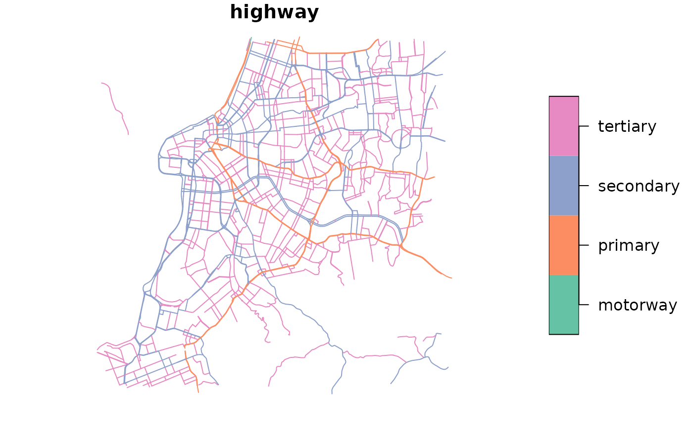

# Using custom OSM car speeds and LTS

Abstract

This vignette shows how to calculate travel times and accessibility with
custom OSM car speeds and Level of Traffic Stress, which can be used to
simulate different scenarios of traffic congestion and road closures, or
interventions in cycling infrastructure.

## 1. Introduction

By default, `R5` routes cars at the legal speed limit of each OSM road
edge, a “free flow” scenario without congestion. Real average speeds are
usually lower because of traffic and driving behavior. Similarly, `R5`
infers the cycling Level of Traffic Stress (LTS) of each road segment
from road speeds, road hierarchy and cycling infrastructure.

This vignette shows how to calculate travel times and accessibility with
custom OSM car speeds or LTS, to simulate traffic congestion, road
closures or interventions in cycling infrastructure. Changes can be
passed as (1) a `data.frame`, for individual road segments, or (2) an
`sf` object, for roads within / touching its geometries. Examples use
the Porto Alegre (Brazil) sample data included in `r5r`.

``` r

# increase Java memory
options(java.parameters = "-Xmx2G")

# load libraries
library(r5r)
library(dplyr)
library(data.table)
library(ggplot2)

# data path
data_path <- system.file("extdata/poa", package = "r5r")

# build network
r5r_network <- r5r::build_network(
  data_path = data_path,
  verbose = FALSE
  )
```

## 2. Changing car speeds

All routing and accessibility functions in {r5r} accept custom OSM car
speeds through two parameters:

- `new_carspeeds`: here, users must pass either a `data.frame` that
  indicates the new car speed for each OSM edge id, OR an
  `sf data.frame` polygon that indicates the new car speed for all the
  roads that fall within each polygon.
- `carspeed_scale`: this parameter allows one to set the default car
  speed for all of the road segments not specified in `new_carspeeds`.
  By default, `carspeed_scale = 1` and the speeds of the unlisted roads
  are kept unchanged.

### 2.1 Changing car speeds by OSM edge

Here we pass new car speeds in a sample `data.frame` shipped with the
package. It must contain the columns `"osm_id"`, `"max_speed"` and
`"speed_type"`. `"speed_type"` is character, either `"scale"` or
`"km/h"`: whether `"max_speed"` is relative to the original speed
(`"scale"`) or an absolute speed (`"km/h"`).

``` r

# read data.frame with new car speeds
edge_speed_factors <- read.csv(
  file.path(data_path, "poa_osm_congestion.csv")
  )

head(edge_speed_factors)
#>      osm_id max_speed speed_type
#> 1  27184648       0.5      scale
#> 2 762361901       0.5      scale
#> 3 568609955       0.5      scale
#> 4 709834913       0.5      scale
#> 5 709834914       0.5      scale
#> 6  77705540       0.5      scale
```

Here all `"max_speed"` values are `0.5` with `speed_type == "scale"`:
the listed OSM edges are driven at 50% of their original OSM speed. Pass
`new_carspeeds` and `carspeed_scale` to any routing or accessibility
function. Here, `carspeed_scale = 0.8` also slows all unlisted roads to
80% of their speed:

``` r

# origins and destination points
points <- read.csv(file.path(data_path, "poa_points_of_interest.csv"))

# travel time matrix
ttm_congestion <- r5r::travel_time_matrix(
  r5r_network = r5r_network,
  origins = points,
  destinations = points,
  mode = 'car',
  departure_datetime = Sys.time(),
  max_trip_duration = 30,
  new_carspeeds = edge_speed_factors,
  carspeed_scale = 0.8
)
#> Warning: A scenario was used for this calculation. This may affect results for WALK or
#> BICYCLE due to missing elevation. See issue #555.
```

Obs. Halving speeds does not necessarily double travel times: car travel
times also depend on intersections, and slower roads can change the
route and hence the trip distance.

#### 2.1.1 Setting different congestion levels by road hierarchy

Here we assume congestion is heavier on roads of higher hierarchy.
First, read the OSM roads from the `.pbf` file and keep the road types
of interest:

``` r

# path to OSM pbf
pbf_path <- paste0(data_path, "/poa_osm.pbf")
  
# read layer of lines from pbf
roads <- sf::st_read(
  pbf_path, 
  layer = 'lines', 
  quiet = TRUE
  )

# Filter only road types of interest
rt <- c("motorway", "primary", "secondary", "tertiary") 

roads <- roads |>
  select(osm_id, highway) |>
  filter(highway %in% rt)

head(roads)
#> Simple feature collection with 6 features and 2 fields
#> Geometry type: LINESTRING
#> Dimension:     XY
#> Bounding box:  xmin: -51.21315 ymin: -30.06624 xmax: -51.15025 ymax: -30.04939
#> Geodetic CRS:  WGS 84
#>     osm_id highway                       geometry
#> 1 26786712 primary LINESTRING (-51.15164 -30.0...
#> 2 26786730 primary LINESTRING (-51.17265 -30.0...
#> 3 26786732 primary LINESTRING (-51.15025 -30.0...
#> 4 26847798 primary LINESTRING (-51.21315 -30.0...
#> 5 26936215 primary LINESTRING (-51.20818 -30.0...
#> 6 26936224 primary LINESTRING (-51.20818 -30.0...
```

The selected roads:

``` r

# map
plot(roads["highway"])
```



Then add a `"max_speed"` column by road type and a `speed_type` column
set to `"scale"`, and make `osm_id` numeric:

``` r

new_edge_speeds <- roads |>
  mutate( 
    osm_id = as.numeric(osm_id),
    max_speed = case_when(
      highway == "motorway"  ~ 0.75,
      highway == "primary"   ~ 0.8,
      highway == "secondary" ~ 0.85,
      highway == "tertiary"  ~ 0.9)) |>
  sf::st_drop_geometry()

new_edge_speeds$speed_type <- "scale"

head(new_edge_speeds)
#>     osm_id highway max_speed speed_type
#> 1 26786712 primary       0.8      scale
#> 2 26786730 primary       0.8      scale
#> 3 26786732 primary       0.8      scale
#> 4 26847798 primary       0.8      scale
#> 5 26936215 primary       0.8      scale
#> 6 26936224 primary       0.8      scale
```

Travel times with the modified car speeds:

``` r

# travel time matrix
ttm_congestion <- r5r::travel_time_matrix(
  r5r_network = r5r_network,
  origins = points,
  destinations = points,
  mode = 'car',
  departure_datetime = Sys.time(),
  max_trip_duration = 30,
  new_carspeeds = new_edge_speeds
  )
```

#### 2.1.2 Setting the same speed limit for the selected road types

To set a 40 km/h speed limit on the same road types (motorway, primary,
secondary, tertiary), set `max_speed = 40` and `speed_type = "km/h"` in
the previous table:

``` r

# edit table with custom speeds to 40 km/h
new_edge_speeds40 <- new_edge_speeds |>
  mutate(max_speed = 40,
         speed_type = "km/h")
  
# travel time matrix
ttm_congestion <- r5r::travel_time_matrix(
  r5r_network = r5r_network,
  origins = points,
  destinations = points,
  mode = 'car',
  departure_datetime = Sys.time(),
  max_trip_duration = 30,
  new_carspeeds = new_edge_speeds40
  )
#> Warning: A scenario was used for this calculation. This may affect results for WALK or
#> BICYCLE due to missing elevation. See issue #555.
```

#### Extra tip:

- **Road closure**: one can simulate a road closure by setting the
  `"max_speed"` value to `0`. This can be quite handy for studies that
  try to measure the resilience of transport systems to network
  disruptions.

### 2.2 Changing car speeds with a spatial polygon

Instead of listing OSM edges, you can set the speed of all roads within
one or more polygons. The sample data has two polygons: one covering the
extended city center, and one covering a few roads that connect two
major avenues.

``` r

# read sf with congestion polygons
congestion_poly <- readRDS(file.path(data_path, "poa_poly_congestion.rds"))

# preview
mapview::mapview(congestion_poly, zcol="scale")
```

The `sf data.frame` must have these columns:

- `"poly_id"`: a unique id for each polygon
- `"scale"`: the speed scaling factor for each polygon, relative to
  original speeds. Absolute speeds in km/h are *not* supported.
- `"priority"`: a number ranking which polygon should be considered in
  case of overlapping polygons.

``` r

head(congestion_poly)
#> Simple feature collection with 2 features and 3 fields
#> Geometry type: POLYGON
#> Dimension:     XY
#> Bounding box:  xmin: -51.24537 ymin: -30.04352 xmax: -51.21426 ymax: -30.02548
#> Geodetic CRS:  WGS 84
#>   poly_id scale priority                       geometry
#> 1       1   0.7        1 POLYGON ((-51.22463 -30.034...
#> 2       2   0.8        2 POLYGON ((-51.21426 -30.034...
```

Here, roads in the city center run at 70% of the speed limit, roads in
the second polygon at 80%, and, with `carspeed_scale = 0.95`, all other
roads at 95%:

``` r

ttm_congestion <- r5r::travel_time_matrix(
  r5r_network = r5r_network,
  origins = points,
  destinations = points,
  mode = 'car',
  departure_datetime = Sys.time(),
  max_trip_duration = 30,
  new_carspeeds = congestion_poly,
  carspeed_scale = 0.95
  )
#> Warning: A scenario was used for this calculation. This may affect results for WALK or
#> BICYCLE due to missing elevation. See issue #555.
```

## 3. Changing cycling LTS values

LTS is changed like car speeds: with a `data.frame` of new LTS values
per OSM edge id, or with an `sf data.frame`. Here the `sf` must be of
type LINESTRING; R5 finds the nearest road to each line and updates its
LTS.

### 3.1 Changing LTS by OSM edge

Suppose protected cycle lanes or tracks were built on a few roads. The
`data.frame` must contain an `"lts"` column with the new LTS value.

``` r

# read data.frame with new lts
edge_lts <- read.csv(
  file.path(data_path, "poa_osm_lts.csv")
  )

head(edge_lts)
#>      osm_id lts
#> 1  27184648   1
#> 2 762361901   1
#> 3 568609955   1
#> 4 709834913   1
#> 5 709834914   1
#> 6  77705540   1
```

Pass it to `new_lts` in any routing/accessibility function:

``` r

ttm_new_lts <- r5r::travel_time_matrix(
  r5r_network = r5r_network,
  origins = points,
  destinations = points,
  mode = 'bicycle',
  departure_datetime = Sys.time(),
  max_trip_duration = 30,
  new_lts = edge_lts
  )
#> Warning: A scenario was used for this calculation. This may affect results for WALK or
#> BICYCLE due to missing elevation. See issue #555.
```

### 3.2. Changing LTS with spatial lines

Alternatively, pass an `sf` LINESTRING of the roads with the
intervention. Here, dedicated cycle lanes along all secondary roads:

``` r

# read sf with congestion polygons
lts_lines <- readRDS(file.path(data_path, "poa_ls_lts.rds"))

# preview
mapview::mapview(lts_lines, zcol="lts")
```

Pass it to `new_lts` as before:

``` r

ttm_new_lts <- r5r::travel_time_matrix(
  r5r_network = r5r_network,
  origins = points,
  destinations = points,
  mode = 'bicycle',
  departure_datetime = Sys.time(),
  max_trip_duration = 30,
  new_lts = lts_lines
  )
#> Warning: A scenario was used for this calculation. This may affect results for WALK or
#> BICYCLE due to missing elevation. See issue #555.
```

## Cleaning up after usage

Stop the network and run Java’s garbage collector to free the memory it
used:

``` r

# stop an specific r5r network
r5r::stop_r5(r5r_network)

# or stop all r5r networks at once
r5r::stop_r5()
rJava::.jgc(R.gc = TRUE)
```

If you have any suggestions or want to report an error, please visit
[the package GitHub page](https://github.com/ipea/r5r).
